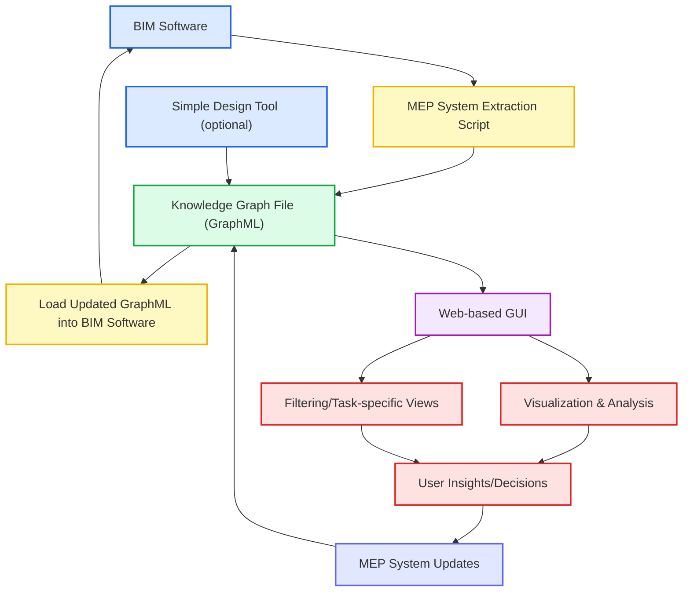

# MACAD-Thesis-MEP-Graph Repository

This repository contains the code and resources for the MACAD Thesis Project on MEP (Mechanical, Electrical, and Plumbing) Graphs. The project focuses on the development of a graph-based approach to analyze MEP systems as knowledge graphs.

## Installation and Setup

### Prerequisites
- Python 3.12 (required for compatibility)
- Git (for cloning the repository)

### Setup Instructions

#### Option 1: Automated Setup (Recommended)

The automated setup scripts will ensure Python 3.12 is used for the virtual environment.

**On Windows:**
```cmd
setup.bat
```

**On macOS/Linux or Windows with Git Bash:**
```bash
chmod +x setup.sh
./setup.sh
```

#### Option 2: Manual Setup

1. **Clone the repository**
   ```bash
   git clone https://github.com/your-username/MACAD-Thesis-MEP-Graph.git
   cd MACAD-Thesis-MEP-Graph
   ```

2. **Create and activate a virtual environment with Python 3.12**
   
   **On Windows (PowerShell):**
   ```powershell
   py -3.12 -m venv venv
   .\venv\Scripts\Activate.ps1
   ```
   
   **On Windows (Command Prompt):**
   ```cmd
   py -3.12 -m venv venv
   venv\Scripts\activate.bat
   ```
   
   **On macOS/Linux:**
   ```bash
   python3.12 -m venv venv
   source venv/bin/activate
   ```

3. **Install required dependencies**
   ```bash
   pip install --upgrade pip
   pip install -r requirements.txt
   ```

4. **Verify the installation**
   ```bash
   python -c "import panel; print('Panel version:', panel.__version__)"
   python -c "import networkx; print('NetworkX version:', networkx.__version__)"
   ```

5. **Run the graph viewer application**
   ```bash
   panel serve graph_viewer.py --show
   ```

### Deactivating the Virtual Environment

When you're done working on the project, deactivate the virtual environment:
```bash
deactivate
```

### Troubleshooting

- **Python 3.12 not found**: If you get an error that Python 3.12 is not installed:
  - **Windows**: Download and install Python 3.12 from [python.org](https://www.python.org/downloads/). Make sure to check "Add Python to PATH" during installation.
  - **macOS**: Install using Homebrew: `brew install python@3.12` or download from [python.org](https://www.python.org/downloads/)
  - **Linux**: Install using your package manager (e.g., `sudo apt install python3.12` on Ubuntu)

- **Permission issues on Windows**: If you encounter execution policy errors when activating the virtual environment, run PowerShell as Administrator and execute:
  ```powershell
  Set-ExecutionPolicy -ExecutionPolicy RemoteSigned -Scope CurrentUser
  ```

- **Package installation issues**: Make sure you have the latest pip version:
  ```bash
  pip install --upgrade pip
  ```

## Prototype Concept
The prototype will consist of a web-based tool that allows users to visualize and analyze a user's MEP system as a knowledge graph. This will enable users to explore the relationships between different components of the MEP system and gain insights into its performance and behavior for proactive maintenance and operations decisions.

We will design a file format that stores the MEP system data in a knowledge graph format, which can be easily imported and exported from BIM software. This will allow users to easily integrate the tool into their existing workflows and leverage the power of GraphML for MEP system analysis.  For the prototype, we will either build a Revit Dynamo script that extracts MEP systems from Revit and converts them into the knowledge graph format and another script that converts the knowledge graph format back into Revit MEP systems (minimum implementation), or we will build a custom Revit plugin that does the same (ideal implementation).  

We may also build a simplistic design tool that allows users to create MEP systems in the knowledge graph format, without needing to use BIM software. This will allow users to quickly create and test MEP systems without needing to go through the full BIM workflow, which can be time-consuming and complex.  For future extensions of the tool, this could allow us to build a more GNN-based design tool that can generate MEP systems based on user-defined parameters and constraints, similar to how generative design tools work for architectural elements, however, this is not the focus of the current project.

We will also build a web-based GUI that loads the knowledge graph data and provides interactive visualization and analysis tools for users to explore their MEP systems.

The GUI will allow users to filter the MEP system graphs to only include the components that are relevant to a particular task, such as maintenance or operations, or renovation planning. This will enable users to focus on the most important elements of the MEP systems and improve the efficiency of their analysis.

Using this workflow, we will have a framework that can be extended to include other design software and tools, without being tied to a specific BIM platform. This will allow us to build a more flexible and adaptable tool that can be used by a wide range of users and organizations.

### Mermaid Diagram of the Prototype Workflow


### Tools Used
We want to only use Python for both the backend and frontend of the prototype, to keep the implementation simple and focused on the MEP system analysis. The following tools will be used:
- **Backend**:
  - **Flask**: A lightweight web framework for building the backend API.  This will allow us to serve the web application and handle requests for loading and updating MEP system files.  This is optional, as we could also allow the frontend to directly load and update the GraphML files, but using Flask will allow us to build a more robust and scalable backend.

- **Frontend**:
  - **Panel**: A high-level app framework for Python that allows us to build interactive web applications with minimal effort.

## File Format for MEP Systems
The MEP system data will be stored in a custom GraphML format, which is a widely used XML-based format for representing graph structures. This format will allow us to easily import and export MEP system data from BIM software and other tools.
The GraphML format will include nodes for each MEP component, such as pipes, ducts, electrical panels, and fixtures, as well as edges representing the relationships between these components. Each node will have attributes that describe its properties, such as size, material, and location, while edges will have attributes that describe the type of connection between components.
The GraphML format will also include metadata about the MEP system, such as the project name, location, and other relevant information. This will allow users to easily identify and manage their MEP systems within the tool.

For now, we will only implement electrical systems, but the format can be easily extended to include other MEP components such as HVAC and plumbing systems in the future.

### Node Attributes
- **id**: Unique identifier for the node.  If exporting from Revit, this will be the Revit element ID.
- **type**: Type of MEP component (e.g., "Electrical Panel", "Circuit", "Fixture").  If exporting from Revit, this will be the Revit Category name, Part Type, Family Name, and Family Type.
- **x**: X coordinate of the component in the MEP system layout.
- **y**: Y coordinate of the component in the MEP system layout.
- **z**: Z coordinate of the component in the MEP system layout.
- **distribution_upstream_voltage**: Voltage of the upstream distribution system as a floating-point number (e.g., 120.0, 240.0).
- **distribution_upstream_current_rating**: Current rating of the upstream distribution system as a floating-point number (e.g., 15.0, 30.0).
- **distribution_upstream_phase_number**: Number of phases for the upstream distribution system (e.g., 1, 3).
- **distribution_upstream_frequency**: Frequency of the upstream distribution system in Hertz (e.g., 50.0, 60.0).
- **distribution_downstream_voltage**: Voltage of the downstream distribution system as a floating-point number (e.g., 120.0, 240.0).
- **distribution_downstream_current_rating**: Current rating of the downstream distribution system as a floating-point number (e.g., 15.0, 30.0).
- **distribution_downstream_phase_number**: Number of phases for the downstream distribution system (e.g., 1, 3).
- **distribution_downstream_frequency**: Frequency of the downstream distribution system in Hertz (e.g., 50.0, 60.0).
- **AIC_rating**: AIC (Ampere Interrupting Capacity) rating of the electrical component as a floating-point number (e.g., 10.0, 22.0).

### Edge Attributes
- **source**: ID of the source node (the component that is connected to the target node).
- **target**: ID of the target node (the component that is connected to the source node).
- **type**: Type of connection (e.g., "Power", "Control", "Data").  This will be used to differentiate between different types of connections in the MEP system.
- **voltage**: Voltage of the connection as a floating-point number (e.g., 120.0, 240.0).
- **current_rating**: Current rating of the connection as a floating-point number (e.g, 15.0, 30.0).  This could be the overcurrent protection rating of the upstream component, or the current rating of the downstream component.
- **phase_number**: Number of phases for the connection (e.g., 1, 3).
- **frequency**: Frequency of the connection in Hertz (e.g., 50.0, 60.0).
- **apparent_current**: Apparent current of the connection as a floating-point number (e.g., 10.0, 22.0).
- **voltage_drop**: Voltage drop across the connection as a floating-point number (e.g., 1.0, 2.0).
- **load_classification**: Load classification of the connection (e.g., "Lighting", "Receptacles", "HVAC").  This will be used to classify the load connected to the component, which can be useful for load analysis and planning.

### Example GraphML Structure
```xml
<?xml version="1.0" encoding="UTF-8"?>
<graphml xmlns="http://graphml.graphdrawing.org/xmlns"
         xmlns:xsi="http://www.w3.org/2001/XMLSchema-instance"
         xsi:schemaLocation="http://graphml.graphdrawing.org/xmlns
         http://graphml.graphdrawing.org/xmlns/1.0/graphml.xsd">
  
  <!-- Node attribute definitions -->
  <key id="type" for="node" attr.name="type" attr.type="string"/>
  <key id="x" for="node" attr.name="x" attr.type="double"/>
  <key id="y" for="node" attr.name="y" attr.type="double"/>
  <key id="z" for="node" attr.name="z" attr.type="double"/>
  <key id="distribution_upstream_voltage" for="node" attr.name="distribution_upstream_voltage" attr.type="double"/>
  <key id="distribution_upstream_current_rating" for="node" attr.name="distribution_upstream_current_rating" attr.type="double"/>
  <key id="distribution_upstream_phase_number" for="node" attr.name="distribution_upstream_phase_number" attr.type="int"/>
  <key id="distribution_upstream_frequency" for="node" attr.name="distribution_upstream_frequency" attr.type="double"/>
  <key id="distribution_downstream_voltage" for="node" attr.name="distribution_downstream_voltage" attr.type="double"/>
  <key id="distribution_downstream_current_rating" for="node" attr.name="distribution_downstream_current_rating" attr.type="double"/>
  <key id="distribution_downstream_phase_number" for="node" attr.name="distribution_downstream_phase_number" attr.type="int"/>
  <key id="distribution_downstream_frequency" for="node" attr.name="distribution_downstream_frequency" attr.type="double"/>
  <key id="AIC_rating" for="node" attr.name="AIC_rating" attr.type="double"/>
  
  <!-- Edge attribute definitions -->
  <key id="connection_type" for="edge" attr.name="type" attr.type="string"/>
  <key id="voltage" for="edge" attr.name="voltage" attr.type="double"/>
  <key id="current_rating" for="edge" attr.name="current_rating" attr.type="double"/>
  <key id="phase_number" for="edge" attr.name="phase_number" attr.type="int"/>
  <key id="frequency" for="edge" attr.name="frequency" attr.type="double"/>
  <key id="apparent_current" for="edge" attr.name="apparent_current" attr.type="double"/>
  <key id="voltage_drop" for="edge" attr.name="voltage_drop" attr.type="double"/>
  <key id="load_classification" for="edge" attr.name="load_classification" attr.type="string"/>
  
  <!-- Graph definition -->
  <graph id="High_School_Electrical_System" edgedefault="directed">
    
    <!-- Utility Transformer -->
    <node id="transformer_001">
      <data key="type">Transformer</data>
      <data key="x">0.0</data>
      <data key="y">0.0</data>
      <data key="z">0.0</data>
      <data key="distribution_upstream_voltage">13800.0</data>
      <data key="distribution_upstream_current_rating">126.0</data>
      <data key="distribution_upstream_phase_number">3</data>
      <data key="distribution_upstream_frequency">60.0</data>
      <data key="distribution_downstream_voltage">480.0</data>
      <data key="distribution_downstream_current_rating">3000.0</data>
      <data key="distribution_downstream_phase_number">3</data>
      <data key="distribution_downstream_frequency">60.0</data>
      <data key="AIC_rating">65.0</data>
    </node>
    
    <!-- Main Switchboard -->
    <node id="switchboard_001">
      <data key="type">Switchboard</data>
      <data key="x">10.0</data>
      <data key="y">5.0</data>
      <data key="z">0.0</data>
      <data key="distribution_upstream_voltage">480.0</data>
      <data key="distribution_upstream_current_rating">3000.0</data>
      <data key="distribution_upstream_phase_number">3</data>
      <data key="distribution_upstream_frequency">60.0</data>
      <data key="distribution_downstream_voltage">480.0</data>
      <data key="distribution_downstream_current_rating">2500.0</data>
      <data key="distribution_downstream_phase_number">3</data>
      <data key="distribution_downstream_frequency">60.0</data>
      <data key="AIC_rating">65.0</data>
    </node>
    
    <!-- Classroom Wing Panelboard -->
    <node id="panelboard_001">
      <data key="type">Panelboard</data>
      <data key="x">50.0</data>
      <data key="y">20.0</data>
      <data key="z">0.0</data>
      <data key="distribution_upstream_voltage">480.0</data>
      <data key="distribution_upstream_current_rating">400.0</data>
      <data key="distribution_upstream_phase_number">3</data>
      <data key="distribution_upstream_frequency">60.0</data>
      <data key="distribution_downstream_voltage">120.0</data>
      <data key="distribution_downstream_current_rating">225.0</data>
      <data key="distribution_downstream_phase_number">1</data>
      <data key="distribution_downstream_frequency">60.0</data>
      <data key="AIC_rating">22.0</data>
    </node>
    
    <!-- Gymnasium Panelboard -->
    <node id="panelboard_002">
      <data key="type">Panelboard</data>
      <data key="x">25.0</data>
      <data key="y">80.0</data>
      <data key="z">0.0</data>
      <data key="distribution_upstream_voltage">480.0</data>
      <data key="distribution_upstream_current_rating">600.0</data>
      <data key="distribution_upstream_phase_number">3</data>
      <data key="distribution_upstream_frequency">60.0</data>
      <data key="distribution_downstream_voltage">277.0</data>
      <data key="distribution_downstream_current_rating">400.0</data>
      <data key="distribution_downstream_phase_number">1</data>
      <data key="distribution_downstream_frequency">60.0</data>
      <data key="AIC_rating">22.0</data>
    </node>
    
    <!-- Kitchen Transformer -->
    <node id="transformer_002">
      <data key="type">Transformer</data>
      <data key="x">15.0</data>
      <data key="y">45.0</data>
      <data key="z">0.0</data>
      <data key="distribution_upstream_voltage">480.0</data>
      <data key="distribution_upstream_current_rating">300.0</data>
      <data key="distribution_upstream_phase_number">3</data>
      <data key="distribution_upstream_frequency">60.0</data>
      <data key="distribution_downstream_voltage">208.0</data>
      <data key="distribution_downstream_current_rating">694.0</data>
      <data key="distribution_downstream_phase_number">3</data>
      <data key="distribution_downstream_frequency">60.0</data>
      <data key="AIC_rating">25.0</data>
    </node>
    
    <!-- Kitchen Panelboard -->
    <node id="panelboard_003">
      <data key="type">Panelboard</data>
      <data key="x">16.0</data>
      <data key="y">46.0</data>
      <data key="z">0.0</data>
      <data key="distribution_upstream_voltage">208.0</data>
      <data key="distribution_upstream_current_rating">694.0</data>
      <data key="distribution_upstream_phase_number">3</data>
      <data key="distribution_upstream_frequency">60.0</data>
      <data key="distribution_downstream_voltage">120.0</data>
      <data key="distribution_downstream_current_rating">400.0</data>
      <data key="distribution_downstream_phase_number">1</data>
      <data key="distribution_downstream_frequency">60.0</data>
      <data key="AIC_rating">25.0</data>
    </node>
    
    <!-- Connections (Edges) -->
    
    <!-- Utility Transformer to Main Switchboard -->
    <edge id="connection_001" source="transformer_001" target="switchboard_001">
      <data key="connection_type">Power</data>
      <data key="voltage">480.0</data>
      <data key="current_rating">3000.0</data>
      <data key="phase_number">3</data>
      <data key="frequency">60.0</data>
      <data key="apparent_current">2800.0</data>
      <data key="voltage_drop">2.5</data>
      <data key="load_classification">Main Distribution</data>
    </edge>
    
    <!-- Switchboard to Classroom Wing Panelboard -->
    <edge id="connection_002" source="switchboard_001" target="panelboard_001">
      <data key="connection_type">Power</data>
      <data key="voltage">480.0</data>
      <data key="current_rating">400.0</data>
      <data key="phase_number">3</data>
      <data key="frequency">60.0</data>
      <data key="apparent_current">350.0</data>
      <data key="voltage_drop">8.5</data>
      <data key="load_classification">Lighting</data>
    </edge>
    
    <!-- Switchboard to Gymnasium Panelboard -->
    <edge id="connection_003" source="switchboard_001" target="panelboard_002">
      <data key="connection_type">Power</data>
      <data key="voltage">480.0</data>
      <data key="current_rating">600.0</data>
      <data key="phase_number">3</data>
      <data key="frequency">60.0</data>
      <data key="apparent_current">580.0</data>
      <data key="voltage_drop">6.2</data>
      <data key="load_classification">HVAC</data>
    </edge>
    
    <!-- Switchboard to Kitchen Transformer -->
    <edge id="connection_004" source="switchboard_001" target="transformer_002">
      <data key="connection_type">Power</data>
      <data key="voltage">480.0</data>
      <data key="current_rating">300.0</data>
      <data key="phase_number">3</data>
      <data key="frequency">60.0</data>
      <data key="apparent_current">280.0</data>
      <data key="voltage_drop">3.8</data>
      <data key="load_classification">Kitchen Equipment</data>
    </edge>
    
    <!-- Kitchen Transformer to Kitchen Panelboard -->
    <edge id="connection_005" source="transformer_002" target="panelboard_003">
      <data key="connection_type">Power</data>
      <data key="voltage">208.0</data>
      <data key="current_rating">694.0</data>
      <data key="phase_number">3</data>
      <data key="frequency">60.0</data>
      <data key="apparent_current">650.0</data>
      <data key="voltage_drop">2.1</data>
      <data key="load_classification">Kitchen Equipment</data>
    </edge>
    
  </graph>
</graphml>

This example demonstrates a typical high school electrical distribution system:
- A 3000A utility transformer (13.8kV to 480V) feeding the main switchboard
- Main switchboard distributing power to various building areas
- Classroom wing panelboard for general lighting and receptacles (480V to 120V)
- Gymnasium panelboard for HVAC systems (480V to 277V for high-bay lighting)
- Kitchen transformer stepping down to 208V for commercial kitchen equipment
- Kitchen panelboard for food service equipment loads
- Realistic current ratings, voltage drops, and load classifications for each connection

The structure demonstrates the hierarchical nature of electrical distribution in large facilities and can be easily extended to include additional panelboards, emergency systems, and specialty equipment.
