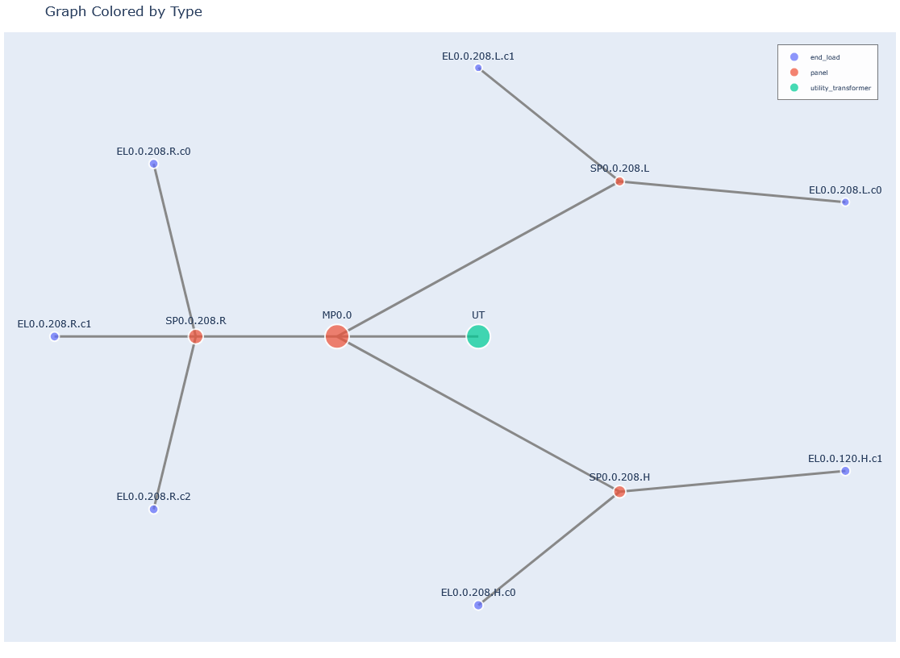

# AssetPulse - Project Paper

## Abstract
AssetPulse is an advanced asset management simulation tool and synthetic data generator designed to optimize resource allocation, improve decision-making, and facilitate research through realistic scenario modeling. Building on a graph-based approach, AssetPulse models asset lifecycles, calculates remaining useful life (RUL), and applies business rules for budget planning, risk management, and both reactive and preventive maintenance. The system aggregates risk, cost, and downtime metrics, supports automated scheduling, and visualizes results through an interactive interface. By enabling robust scenario analysis and comprehensive planning, AssetPulse helps users optimize maintenance strategies and resource allocation for complex building systems and infrastructure networks. This paper discusses the objectives, research questions, methodology, and future work related to the project.

## Introduction
### Problem
Effective management of physical assets is critical for operational efficiency and cost control across industries. However, many organizations face challenges in modeling asset lifecycles, predicting maintenance needs, and allocating resources optimally due to a lack of data-driven decision-assistance tools.

AssetPulse aims to address these challenges by providing a simulation environment that allows users to model asset behaviors, evaluate different budget strategies, and make informed decisions based on simulated outcomes.

### Objectives
1. Develop a graph-based simulation tool that models asset management scenarios, including asset lifecycles, maintenance schedules, and budget allocations.
2. Create a synthetic data generator to produce realistic datasets for testing and validating asset management strategies.
3. Enable users to visualize and analyze the impact of different asset management decisions through interactive dashboards and reports.
4. Compare the effectiveness of various budget allocation strategies in asset management through simulation experiments.
5. Optimize budget allocation strategies based on different metrics such as maximizing asset longevity, maximizing equipment condition, and minimizing monthly costs.

### Interface
We designed an intuitive user interface that allows users to easily set up simulation scenarios, define asset parameters, allocate budgets, and visualize results. The interface includes features such as file upload/download, interactive graphs, and customizable reports to enhance user experience and facilitate decision-making.

We see the interface as both a research tool and a practical application for asset managers, enabling them to explore various strategies and their outcomes in a user-friendly manner.  While the interface is not a finished product, it provides a solid foundation for future development and refinement based on user feedback and evolving needs in asset management.  And despite its current limitations, it effectively demonstrates the core functionalities and potential of the AssetPulse system.

The interface is built using the Panel library from Holoviz, which provides a flexible and powerful framework for creating interactive web applications in Python.  It can be easily extended and customized to meet specific user requirements and integrate additional features as needed.  It also supports deployment as a standalone web application or integration into existing asset management platforms, as a future area of improvement.

## Research Questions
1. How can graph-based methods support the tracking of changes and lifecycle management of building systems?
2. How can synthetic data generation be utilized to create realistic asset management scenarios for testing and validation?
3. What are the comparative advantages of different budget allocation strategies in asset management?
4. How can simulation tools be designed to facilitate user interaction and decision-making in asset management?

## Methodology
### Simulation Tool Development
- Graph-Based Modeling
    -  Utilize graph structures to represent assets, their relationships, and lifecycle
- Simulation Engine
    -  Implement a simulation engine that allows users to define scenarios, allocate budgets, and simulate asset behaviors over time.
- User Interface
    -  Design an intuitive user interface for scenario setup, simulation execution, and result visualization.
- Synthetic Data Generator
    -  Develop a module to create realistic synthetic datasets that mimic asset characteristics, failure modes, and maintenance histories for testing and validation purposes.
- Validation and Evaluation
    -  Conduct experiments to validate the simulation accuracy and evaluate the impact of different budget allocation strategies using the synthetic data.

## Synthetic Data Generation
To quickly generate realistic building data for testing and validation, we developed a synthetic data generator. This tool creates building electrical system graphs based on the following user-defined parameters:

### User-Defined Parameters
- Construction Year
  - Older buildings will allow the simulation of more failures and maintenance needs.
- Total Load (kW)
  - The total electrical load of the building, influencing the number and type of distribution equipment.
- Building Length (m)
  - The length of the building footprint, affecting spatial distribution of equipment and the number of vertical risers.
- Building Width (m)
  - The width of the building footprint, affecting spatial distribution of equipment and the number of vertical risers.
- Number of Floors
  - The total number of floors, determining vertical distribution and riser lengths.
- Floor Height (m)
  - The height of each floor, influencing vertical spacing and riser lengths.
- Cluster Strength (m)
  - This parameter determines how many end loads are grouped together in the final generated graph.  It does not affect the distribution equipment generation.  A value of 0 means that all end loads will be maximally clustered, while a value of 1 means that all end loads will be individually included.
- Random Seed
  - An optional integer seed for random number generation to ensure reproducibility of the synthetic data.

### Building Electrical System Generation Logic
The synthetic data generator uses the provided parameters to create a building electrical system graph. The process involves:

1. Define Building Characteristics 
   - Validate and record user-specified parameters such as total electrical load, building dimensions, number of floors, and floor height. Calculate derived attributes like total area.

2. Determine Number of Vertical Risers
    -  Calculate the number of risers required for efficient electrical distribution, based on building area and a rule of thumb (e.g., one riser per 500 square meters per floor).

3. Locate Risers
    -  Place risers within the building footprint, spaced along the longer dimension and centered along the shorter dimension, with some randomness to avoid perfect regularity.

4. Determine Building Voltage Level
    -  Select the appropriate voltage system (e.g., 120/208V or 277/480V) based on the total electrical load. If high voltage is required, include step-down transformers for distribution.

5. Distribute Loads Across Floors
    -  Allocate the total electrical load across all floors, introducing random variation (±10") to simulate realistic load distribution. Assign end loads (lighting, receptacles, HVAC, etc.) to each floor, ensuring the sum matches the total load.

6. Assign End Loads to Risers
    -  For each end load, determine its location and assign it to the nearest riser. Each end load is given a type, power rating, and voltage level based on the building system.

7. Determine Riser Attributes on Each Floor
    -  For each riser on each floor, summarize the total power per end load type and voltage. This helps in sizing distribution equipment and understanding load distribution.

8. Place Distribution Equipment
    -  For each riser and floor, place distribution equipment (main panels, sub-panels, transformers) according to the end loads and voltage requirements. Include step-down transformers and multiple distribution panels as needed.

9.  Connect Nodes
    -  Build the graph by connecting utility transformers to main panels, main panels to risers, risers to distribution equipment, and distribution equipment to end loads. Ensure logical hierarchy and connectivity.

10. Apply Risk and Remaining Useful Life (RUL) Scores
    -  Use helper modules to assign risk scores and RUL values to each node in the graph, simulating equipment aging and maintenance needs.

11. Reporting and Output
    -  Print a summary report of the generated building, including total load, equipment counts, end load breakdown, and per-floor/riser details. Save the graph in GraphML format for further analysis or visualization.

An example of a simple building generated using these parameters is provided in Appendix A.  Another example of a more complex building is provided in Appendix B.

For all subsequent sections, the complex building from Appendix B will be used as the reference example.  This allows us to illustrate the various features and outputs of the AssetPulse simulation tool in a more comprehensive manner.

Because the synthetic data generator generates a complete building electrical system graph with detailed attributes, it can be used to test and validate the RUL simulation and maintenance scheduling features of AssetPulse.  The generated graph includes all necessary node types, connections, and attributes required for the RUL simulation engine to function effectively.

The generated electrical system logic first distributes loads through an approximation of a building, then sizes and places distribution equipment based on the load requirements and building layout and assigns the loads to the appropriate distribution equipment.  Finally, it connects all nodes in a logical hierarchy from utility transformer to end load.

This allows us to determine the electrical load (amperage and power) at each node, which is later used for assessing the risk score for each piece of equipment.  When calculating the remaining useful life (RUL) during the simulation, the risk score is used to prioritize maintenance tasks and influence failure probabilities.

This allows us to determine which equipment should be maintained in situations where budget constraints prevent all maintenance from being performed.  Equipment with higher risk scores, such as main panels and switchboards, will be prioritized for maintenance tasks, while lower-risk equipment may have tasks deferred.

Should the lower risk equipment fail due to deferred maintenance, the resulting failure event should affect less of the overall system performance, as the higher risk equipment will have been maintained and is less likely to fail.

### Other System Graphs
The synthetic data generator can be adapted to create other types of system graphs beyond building electrical systems. For example, with modification it could generate water distribution networks, HVAC systems, or transportation infrastructure graphs by modifying the node types, connections, and attributes according to the specific domain requirements. This flexibility allows AssetPulse to be applied to a wide range of asset management scenarios across different industries.

The key parameters used in the remaining useful life (RUL) simulation are described in the next section.  To apply the RUL simulation to a different type of system graph, the user would need to define appropriate equipment types, lifespans, failure rates, and maintenance tasks relevant to that domain, however the core simulation logic would remain the same.

For example, in a water distribution network, equipment types might include pumps, valves, and pipes, each with their own lifespans and failure modes. Maintenance tasks could involve inspections, cleaning, and replacements specific to water systems. By adjusting these parameters and templates, the RUL simulation can be effectively applied to various asset management contexts.

One would also need to ensure that the graph nodes include load information to determine risk scores, or alternatively develop a different method for assessing risk based on the specific attributes of the equipment in that domain.

The required node attributes for the RUL simulation are:
- type
  - Type of equipment (e.g., "transformer", "panel", "switchboard", "end load")
- installation_date
  - Date when the equipment was installed (format: "YYYY-MM-DD")
- expected_lifespan
  - Expected lifespan of the equipment in years (optional; if not provided, defaults will be used based on type)
- replacement_cost
  - Cost to replace the equipment, allows for varying costs based on unique instances of an equipment type.  For example, a larger transformer may cost more to replace than a smaller one of the same type.
- current_condition
  - Current condition of the equipment, on a scale from 0.0 (failed) to 1.0 (new). If not provided, defaults to 1.0.

## Risk Assessment
Before calculating RUL, the simulation engine assesses the risk level of failure for each piece of equipment based on its graph attributes.  This assessment uses the load seen at each node and the quantity of total downstream equipment nodes in the graph to determine a risk score.  Equipment with higher loads and more downstream dependencies will have higher risk scores, indicating that their failure would have a more significant impact on the overall system performance.

We use the following formula to calculate the risk score for each piece of equipment:

```
propagated_power = graph.nodes[node].get('propagated_power', 0) or 0
norm_power = propagated_power / total_load if total_load else 0
descendants_count = filtered_descendants_count(graph, node)
norm_descendants = descendants_count / max_descendants
risk = (norm_power + norm_descendants) / 2
```

The filtered_descendants_count function counts the number of downstream equipment nodes, excluding end loads, to focus on critical distribution components. The risk score is then normalized between 0 and 1, with higher values indicating greater risk.

## Remaining Useful Life (RUL) Simulation
Once the synthetic building data is generated, users can simulate the Remaining Useful Life (RUL) of equipment based on various parameters. These parameters allow users to customize how maintenance deferrals, aging, and equipment types affect RUL calculations.

### User-Defined Simulation Parameters
- TASK_DEFERMENT_FACTOR
  - Impact of each deferred maintenance task on RUL reduction. Higher values increase the penalty for deferred tasks.
- OVERDUE_IMPACT_MULTIPLIER
  - Multiplier for how much overdue maintenance affects RUL. Higher values make overdue tasks more detrimental.
- AGING_ACCELERATION_FACTOR
  - Rate at which aging increases failure probability. Higher values mean equipment ages faster.
- MAX_AGING_MULTIPLIER
  - Maximum cap on aging impact. Prevents runaway aging effects.
- DEFAULT_LIFESPANS
  - Default expected lifespans (in years) for different equipment types.
- BASE_FAILURE_RATES
  - Base annual failure probabilities for different equipment types.
- DEFAULT_INITIAL_CONDITION
  - Initial condition rating for new equipment (1.0 = perfect).
- MIN_RUL_RATIO
  - Minimum ratio of expected lifespan that RUL can be reduced to prevent unrealistic low values.
- CRITICAL_RUL_THRESHOLD_YEARS
  - RUL threshold (in years) below which equipment is considered CRITICAL risk.
- HIGH_RUL_THRESHOLD_YEARS
  - RUL threshold (in years) below which equipment is considered HIGH risk.
- MEDIUM_RUL_THRESHOLD_YEARS
  - RUL threshold (in years) below which equipment is considered MEDIUM risk.
- REPLACEMENT_THRESHOLD_YEARS
  - Risk level at which equipment is flagged for replacement. Set to None to disable.
- ENABLE_RUL_WARNINGS
  - Enable or disable warnings for critically low RUL during calculations.
- ENABLE_DEBUG_OUTPUT
  - Enable or disable detailed debug output during RUL calculations.
- TYPES_TO_IGNORE
  - Equipment types to exclude from RUL calculations.

#### Default Lifespans
| Equipment Type       | Default Lifespan (years) |
|----------------------|--------------------------|
| Utility Transformer  | 35                       |
| Transformer          | 30                       |
| Switchboard          | 25                       |
| Panelboard           | 20                       |
| End Load             | 15                       |

#### Default Base Failure Rates

| Equipment Type       | Base Failure Rate (annual) |
|----------------------|---------------------------|
| Utility Transformer  | 1.5%                      |
| Transformer          | 2.0%                      |
| Switchboard          | 2.5%                      |
| Panelboard           | 3.0%                      |
| End Load             | 5.0%                      |

#### Maintenance Task Templates
Maintenance tasks are defined using a template that specifies the type of task, associated equipment types, frequency, time and money costs, and priority. These template helps standardize maintenance activities across different equipment. The simulation engine uses the uploaded maintenance task template to generate and schedule maintenance tasks for each piece of equipment in the building graph.

When the simulation engine processes maintenance tasks, it generates detailed tasks based on the equipment type and the recommended frequency specified in the template. Each task is linked to a specific equipment node and scheduled accordingly. Tasks are prioritized based on risk score and template priority, with replacement tasks for critical equipment considered before routine maintenance.

For example, a maintenance task template might specify that all "panel" equipment requires a "grounding test" every 12 months with a time cost of 2 hours and a money cost of $150. The simulation engine will create individual grounding test tasks for each panel in the building graph, scheduled based on their installation date and the recommended frequency.

Each month could include a mix of scheduled tasks, executed tasks, and deferred tasks. The scheduled tasks list will show all tasks that were planned for that month, including those that were deferred from previous months. The executed tasks list will show which of those scheduled tasks were actually completed, while the deferred tasks list will indicate which tasks could not be completed due to budget constraints or other factors.

##### Maintenance Task Template Fields
- task_id
  - The unique identifier for the maintenance task. When the tasks for each piece of equipment are generated from the template, this field is concatenated with the equipment ID to ensure uniqueness.
- equipment_type
  - The type of equipment this maintenance task applies to (e.g., "panel", "transformer").
- task_type
  - The category of maintenance task (e.g., "inspection", "cleaning", "testing").
  - Replacement tasks are handled separately using the Replacement Task Templates.
- recommended_frequency_months
  - The recommended interval (in months) between recurring maintenance tasks.  Tasks will be scheduled based on this frequency starting from the equipment installation date.  When a task is deferred, the next occurrence will be scheduled based on the deferral date.
- description
  - A brief explanation of the maintenance task's purpose and activities. This field is optional and can be left blank.
- default_priority
  - The default priority level assigned to the task for scheduling and resource allocation.  Lower numbers indicate higher priority.  Tasks with the same priority are scheduled based on the node's risk score.
- time_cost
  - Estimated time required to complete the task (in hours).
- money_cost
  - Estimated monetary cost to perform the task (in dollars).
- notes
  - Additional information or special instructions related to the task. This field is optional and can be left blank.

#### Replacement Task Templates
Replacement tasks are defined using a template that specifies the type of replacement, associated equipment types, time and money costs, and condition thresholds. The simulation engine uses the uploaded replacement task template to generate and schedule replacement tasks for equipment flagged for replacement based on RUL and condition.

Replacement tasks are prioritized before routine maintenance tasks and are scheduled when equipment is flagged for replacement due to low RUL or poor condition, subject to budget constraints.  These tasks can be deferred if budgets do not allow for immediate replacement, but they will be tracked until completed.  

If multiple pieces of equipment are flagged for replacement in the same month, the simulation engine will prioritize replacements based on risk level and available budget.  This can cause scenarios where for many consecutive months, all available budget is consumed by replacement tasks, leading to deferral of routine maintenance tasks.  This behavior reflects real-world scenarios where critical replacements take precedence over regular upkeep.

##### Replacement Task Template Fields
- task_id
- equipment_type
- task_name
- description
- time_cost
- money_cost
- condition_level
- condition_im

#### Budget Parameters
The simulation engine allows users to define monthly budgets for maintenance tasks, including time and money constraints. These budgets influence which tasks can be executed each month, with higher-priority tasks being scheduled first. Users can also enable budget rollover, allowing unused budget from one month to carry over to the next.

We see these as the key parameters for getting useful simulation results.  In the real world, budgets may vary month to month, and our simulation engine and analysis tools can allow operators to explore the impact of different budget scenarios on asset management outcomes.  

The budget parameters are:
- Monthly Budget (Hours)
  - Set the monthly hour budget for maintenance tasks. This limits how many maintenance activities can be performed each month.
- Monthly Budget (Dollars)
  - Set the monthly dollar budget for maintenance tasks. This limits the total cost of maintenance activities each month.
- Enable Budget Rollover (Boolean)
  - Allow unused budget from one month to carry over to the next, providing flexibility in scheduling.  To best simulate real-world scenarios, we recommend lowering the monthly time and money budgets if this option is enabled, to prevent unrealistic accumulation of budget over time.  We recommend not enabling this option if the goal is to simulate a strict monthly budget scenario, as indefinite budget accumulation is not realistic.
- Weeks to Schedule Ahead
  - Set how many weeks past the current date the maintenance scheduler should plan tasks. The simulation will always simulate between the system's construction date and the current date.

#### Input Reflections

In reality these maintenance and replacement tasks would be determined by the specific equipment and manufacturer recommendations.  For the purposes of this simulation, we use generic replacement tasks that apply to broad equipment categories.  Users can customize the replacement task templates to better reflect their specific asset management practices.

Increased simulation accuracy may even require more granular equipment types in the graph to ensure that the correct replacement tasks are applied.  For example, if a user wants to differentiate between different sizes or models of transformers, they may need to create separate equipment types in the graph (e.g., "transformer_small", "transformer_large") and define corresponding replacement tasks for each type.  This allows for more precise control over maintenance and replacement strategies based on the specific characteristics of the equipment.  

We see this as an area for future improvement, where future researchers can explore more detailed equipment classifications and their impact on asset management strategies, based on real-world data and practices.

### Simulation Logic

Once the user sets the RUL simulation parameters, the simulation engine uses these values to calculate the Remaining Useful Life (RUL) for each piece of equipment in the building graph over each month of the simulation period. The process involves:

1. Task Generation
   - Maintenance tasks are generated from the building graph and generic/replacement task templates, with each task linked to a specific equipment node and scheduled based on installation date and recommended frequency.

2. Initialize RUL Parameters
   - The simulation engine loads user-defined RUL parameters, including equipment lifespans, failure rates, aging factors, maintenance impact factors, and risk thresholds.

3. Iterate Over Simulation Period
    - For each month in the simulation period, the engine updates the current date and recalculates RUL for all equipment nodes in the graph.

4. Calculate RUL for Each Node
   - For each equipment node, determine its installation date, expected lifespan, and operating history.
   - Compute the baseline RUL as the difference between expected lifespan and operating time.
   - Adjust RUL for deferred maintenance tasks using the task deferment factor and overdue impact multiplier.
   - Apply aging acceleration and cap aging impact using the aging acceleration factor and maximum aging multiplier.
   - Adjust RUL based on current equipment condition, ensuring a minimum condition factor is applied.
   - Ensure RUL does not fall below a minimum ratio of expected lifespan.

5. Assess Risk Level and Failure Probability
   - For each node, calculate annual failure probability using base failure rates, aging factor, and condition.
   - Assign a risk level (LOW, MEDIUM, HIGH, CRITICAL) based on RUL thresholds and condition.
   - Flag equipment for replacement if risk level meets the replacement threshold.

6. Update Graph Attributes
   - Store calculated RUL (in days and years), risk level, failure probability, and condition history in each node's attributes.
   - Optionally, print warnings for critically low RUL or high failure risk if enabled.


6. Maintenance Task Scheduling and Execution
   - For each month, the simulation engine generates a prioritized schedule of maintenance tasks for equipment nodes, using generic and replacement task templates.
   - Tasks are scheduled based on recommended frequency, equipment installation date, and current risk level.
   - Each task includes time and money cost estimates, priority, and status (pending, in progress, complete).
   - Monthly budgets for time and money are enforced; tasks exceeding the budget are deferred to future months. If budget rollover is enabled, unused budget carries forward.
   - Synthetic maintenance logs can be generated for each node to simulate observed condition changes, using randomized condition values and log entries.
     - Synthetic logs include a date, condition rating (0.0–1.0), and description.
     - Synthetic logs use a random seed for reproducibility and employ a beta distribution to model realistic condition changes:
       - `new_condition = round(random.betavariate(alpha=5, beta=1) * current_condition, 1)`
   - Replacement tasks are triggered for equipment with low condition or high risk, prioritized before routine tasks.
   - For each executed task, the equipment node's condition is improved, and the maintenance history is updated. Deferred tasks increase the deferred count, impacting future RUL calculations.

7. Reporting and Analysis
   - After each month, the simulation engine records the scheduled, executed, and deferred tasks, maintenance logs, and replacement actions.
   - The updated graph state (including RUL, condition, and risk) is saved for each month, enabling time-series analysis.
   - System-wide summaries include total tasks scheduled, executed, deferred, and replaced, as well as budget utilization and risk distribution.
   - Detailed component-level metrics and maintenance histories are available for further analysis and visualization.

### Simulation Output
The simulation engine outputs each month's RUL and risk assessment results in a dictionary format, with keys representing the month (e.g., "2023-01"). Each month's record contains:
- Month identifier (e.g., "2023-01")
- List of tasks scheduled for the month
  - This list includes all tasks that were scheduled, regardless of whether they end up executed or deferred.  Tasks that were deferred from previous months will also appear in this list, since they will need to be tracked until they are completed.
- rollover_time_budget
  - Unused time budget carried over from previous month (if rollover is enabled)
- rollover_money_budget
  - Unused money budget carried over from previous month (if rollover is enabled)
- time_budget
  - Total time budget allocated for the month
  - This is added to the rollover_time_budget to determine the total time available for maintenance tasks in the month.
  - The time budget is refreshed at the start of each month based on user settings.
- money_budget
  - Total money budget allocated for the month
  - This is added to the rollover_money_budget to determine the total money available for maintenance tasks in the month.
  - The money budget is refreshed at the start of each month based on user settings.
- graph
  - The updated building graph with current RUL, risk levels, and condition for all equipment nodes, other metadata, and structural information, enabling detailed time-series analysis and visualization.
  - This graph reflects all changes made during the month, including executed maintenance tasks, condition updates, and any replacements.
  - The graph is stored in NetworkX format for compatibility with various analysis and visualization tools.
- executed_tasks
  - List of tasks that were successfully executed during the month, including details such as task type, associated equipment, time and money costs, and completion status.
- deferred_tasks
  - List of tasks that were deferred during the month, including reasons for deferral and any impacts on future scheduling.
- maintenance_logs
  - Records of all maintenance activities performed during the month, including inspections, repairs, and replacements.
  - These are synthetic logs generated to simulate real-world maintenance records if synthetic log generation is enabled.
- replacement_tasks_executed
  - List of equipment replacement tasks completed during the month, with details on replaced components and associated costs.
- replacement_tasks_not_executed
  - List of planned replacement tasks that were not executed, including reasons.

## Simulation Analysis and Visualization

### System Health Overview
The system health overview provides a very high-level summary of the overall condition and risk levels of all equipment.  An example output is shown below:
<br>
&nbsp; **Average Condition:** 97%
&nbsp; **Total Number of Nodes:** 40
&nbsp; **Risk Levels: LOW:** 31 | **MEDIUM:** 8 | **HIGH:** 1

### Critical Component Overview
The critical component overview highlights the most at-risk equipment in the system, allowing users to quickly identify components that may require immediate attention.  An example output is shown below:

**Critical Components:** 16
1. MP0.0
1. TR0.0.208.L
1. TR0.0.208.R
1. TR0.0.208.H
1. MP1.0
1. TR1.0.208.L
1. TR1.0.208.R
1. TR1.0.208.H
1. MP2.0
1. TR2.0.208.L
1. TR2.0.208.R
1. TR2.0.208.H
1. MP3.0
1. TR3.0.208.L
1. TR3.0.208.R
1. TR3.0.208.H

### Next 12 Months Overview
The next 12 months overview provides a summary of scheduled maintenance tasks, executed tasks, deferred tasks, and budget utilization for the upcoming year.  An example output is shown below:

**2025-10:**
- **Expected Executed Tasks:** 7
- **Most Critical Expected Task:** P-03-MP2.0
- **Deferred Tasks:** 136
- **Most Critical Deferred Task:** S-05-MP0.0

**2025-11:**
- **Expected Executed Tasks:** 5
- **Most Critical Expected Task:** P-02-SP0.0.480.R
- **Deferred Tasks:** 135
- **Most Critical Deferred Task:** S-05-MP0.0

**2025-12:**
- **Expected Executed Tasks:** 6
- **Most Critical Expected Task:** P-03-SP3.0.480.R
- **Deferred Tasks:** 134
- **Most Critical Deferred Task:** S-05-MP0.0

**2026-01:**
- **Expected Executed Tasks:** 3
- **Most Critical Expected Task:** S-03-MP0.0
- **Deferred Tasks:** 138
- **Most Critical Deferred Task:** S-05-MP0.0

**2026-02:**
- **Expected Executed Tasks:** 9
- **Most Critical Expected Task:** S-04-MP0.0
- **Deferred Tasks:** 140
- **Most Critical Deferred Task:** S-05-MP0.0

**2026-03:**
- **Expected Executed Tasks:** 8
- **Most Critical Expected Task:** P-03-MP3.0
- **Deferred Tasks:** 135
- **Most Critical Deferred Task:** S-05-MP0.0

**2026-04:**
- **Expected Executed Tasks:** 7
- **Most Critical Expected Task:** P-02-MP1.0
- **Deferred Tasks:** 131
- **Most Critical Deferred Task:** S-05-MP0.0

**2026-05:**
- **Expected Executed Tasks:** 8
- **Most Critical Expected Task:** P-02-MP2.0
- **Deferred Tasks:** 125
- **Most Critical Deferred Task:** S-05-MP0.0

**2026-06:**
- **Expected Executed Tasks:** 6
- **Most Critical Expected Task:** P-03-SP3.0.480.R
- **Deferred Tasks:** 123
- **Most Critical Deferred Task:** S-05-MP0.0

**2026-07:**
- **Expected Executed Tasks:** 2
- **Most Critical Expected Task:** S-03-MP0.0
- **Deferred Tasks:** 124
- **Most Critical Deferred Task:** S-05-MP0.0

**2026-08:**
- **Expected Executed Tasks:** 11
- **Most Critical Expected Task:** P-02-SP1.0.480.H
- **Deferred Tasks:** 125
- **Most Critical Deferred Task:** S-05-MP0.0

**2026-09:**
- **Expected Executed Tasks:** 8
- **Most Critical Expected Task:** P-03-MP3.0
- **Deferred Tasks:** 124
- **Most Critical Deferred Task:** S-05-MP0.0

### Cost Forecast Overview
The cost forecast provides an estimate of the financial resources required to support the planned maintenance activities over the next 12 months. It accounts for expected executed tasks, deferred tasks, and associated time and money costs, enabling informed budgeting and resource allocation decisions.  An example output is shown below:

**Total Expected Money Cost for Next 12 Months:** $1770.0
**Total Expected Time Cost for Next 12 Months:** 36.0 hours

### Task Status Each Month Chart
The task status each month chart visualizes the number of executed, and deferred maintenance tasks over the simulation period as a stacked bar chart. This chart helps users understand trends in maintenance activities and identify periods of high deferral or execution rates.

Preset time windows are available for quick selection, including 3 months, 6 months, 12 months, and the full simulation period. Users can also customize the time window by adjusting the timeline slider to focus on specific periods of interest.  The default view shows the previous 6 months and the next 12 months.

An example chart is shown below:


### Node Failure Timeline Chart
The node failure timeline chart visualizes the expected failure events of equipment nodes over the simulation period. This chart helps users identify when and which components are likely to fail, supporting proactive maintenance planning and risk mitigation.

The chart is sorted by the node risk score, with higher-risk nodes displayed at the top. Each node is represented by circular markers indicating the expected failure dates. The size of each marker corresponds to the risk level of the node, with larger markers indicating higher risk.

An example chart is shown below:


### 

## Future Work
Future enhancements to AssetPulse could include:
1. Using real-world asset history and maintenance data to determine accurate simulation parameters, refine simulation logic, and validate synthetic data generation.
2. Incorporating more complex asset interactions and dependencies in the graph model to better simulate real-world scenarios.
3. Incorporate remodeling and expansion scenarios to simulate changes in building systems over time.
4. Integrate machine learning techniques to predict failures and optimize maintenance schedules based on historical data.
5. Expand the user interface to include more advanced visualization and reporting features, enabling deeper insights into asset management strategies.
6. Expand the user interface to include more advanced system graph interaction and editing capabilities, allowing users to modify the building graph directly within the application.
7. Incorporate real-time data integration from building management systems (BMS) or Internet of Things (IoT) sensors to inform RUL calculations and maintenance scheduling.
8. Develop a collaborative platform where multiple users can work on the same asset management scenarios, sharing insights and strategies.

## Appendix A: Example Test Data: Simple Building
The following parameters were used to generate a simple building for testing and validation of the AssetPulse simulation tool:
- Construction Year: 2000
- Total Load: 200 kW
- Building Length: 20 m
- Building Width: 20 m
- Number of Floors: 1
- Floor Height: 3.5 m
- Cluster Strength: 0.95
- Random Seed: 42

### Example Generated Building Graph

#### Types of Nodes


#### Risk Levels


### Maintenance Task Input Template
| index |task_id|equipment_type|task_type                        |recommended_frequency_months|description                                                                     |default_priority|time_cost|money_cost|notes                                               |
|-------|-------|--------------|---------------------------------|----------------------------|--------------------------------------------------------------------------------|----------------|---------|----------|----------------------------------------------------|
| 0     |T-01   |transformer   |visual inspection                |9                           |Visually inspect for corrosion, scoring, stains or any other indicators of wear.|2               |0.5      |50        |Check for oil leaks and discoloration.              |
| 1     |T-02   |transformer   |test winding ratios              |24                          |Test transformer winding ratios to ensure correct operation.                    |1               |1        |100       |Use appropriate test equipment.                     |
| 2     |T-03   |transformer   |test grounding                   |12                          |Test transformer grounding connections for integrity.                           |1               |0.5      |30        |Ensure all ground connections are secure.           |
| 3     |T-04   |transformer   |test torque of bolted connections|18                          |Check and retorque all bolted electrical connections.                           |2               |0.5      |20        |Follow manufacturer's torque specifications.        |
| 4     |T-05   |transformer   |replacement                      |120                         |Replace transformer at end of service life or if failed.                        |1               |8        |5000      |Coordinate with utility if required.                |
| 5     |P-01   |panel         |visual inspection                |4                           |Visually inspect panel for signs of overheating, corrosion, or damage.          |2               |0.5      |30        |Check for missing or loose covers.                  |
| 6     |P-02   |panel         |test grounding                   |12                          |Test panel grounding and bonding connections.                                   |1               |0.5      |20        |Verify all ground lugs are tight.                   |
| 7     |P-03   |panel         |test gfci                       |6                           |Test all GFCI breakers and receptacles for proper operation.                    |1               |0.25     |10        |Document any failed devices.                         |
| 8     |P-04   |panel         |inspect breakers                |9                           |Inspect all breakers for signs of wear or damage.                               |2               |0.5      |15        |Replace any defective breakers.                      |
| 9     |P-05   |panel         |replacement                    |100                         |Replace panel at end of service life or if failed.                              |1               |6        |2000      |Label all circuits after replacement.                |
| 10    |S-01   |switchboard   |visual inspection              |6                           |Visually inspect switchboard for signs of overheating, corrosion, or damage.    |2               |2        |60        |Check for missing or loose covers.                   |
| 11    |S-02   |switchboard   |test grounding                 |12                          |Test switchboard grounding and bonding connections.                             |1               |2        |40        |Verify all ground lugs are tight.                    |
| 12    |S-03   |switchboard   |test circuit breakers          |6                           |Test all circuit breakers for proper operation.                                 |1               |1        |20        |Document any failed devices.                          |
| 13    |S-04   |switchboard   |test voltage                  |12                          |Test switchboard voltage levels.                                                |1               |1        |30        |Ensure all voltage levels are within specifications.|
| 14    |S-05   |switchboard   |replacement                   |110                         |Replace switchboard at end of service life or if failed.                        |1               |48       |3500      |Coordinate with utility if required.                  |

### Generated Detailed Maintenance Tasks
| index |task_instance_id|equipment_id|equipment_type                   |task_type|priority                                                                        |time_cost|money_cost|notes|description                                         |task_id|recommended_frequency_months|equipment_installation_date|risk_score          |is_replacement|
|----------------|----------------|------------|---------------------------------|---------|--------------------------------------------------------------------------------|---------|----------|-----|----------------------------------------------------|-------|----------------------------|---------------------------|--------------------|--------------|
|  0 |P-01-MP0.0      |MP0.0       |panel                            |visual inspection|2                                                                               |0.5      |30.0      |Check for missing or loose covers.|Visually inspect panel for signs of overheating, corrosion, or damage.|P-01   |4                           |2000-01-01                 |0.8                 |False         |
|  1 |P-02-MP0.0      |MP0.0       |panel                            |test grounding|1                                                                               |0.5      |20.0      |Verify all ground lugs are tight.|Test panel grounding and bonding connections.       |P-02   |12                          |2000-01-01                 |0.8                 |False         |
|  2 |P-03-MP0.0      |MP0.0       |panel                            |test gfci|1                                                                               |0.25     |10.0      |Document any failed devices.|Test all GFCI breakers and receptacles for proper operation.|P-03   |6                           |2000-01-01                 |0.8                 |False         |
|  3 |P-04-MP0.0      |MP0.0       |panel                            |inspect breakers|2                                                                               |0.5      |15.0      |Replace any defective breakers.|Inspect all breakers for signs of wear or damage.   |P-04   |9                           |2000-01-01                 |0.8                 |False         |
|  4 |P-05-MP0.0      |MP0.0       |panel                            |replacement|1                                                                               |6.0      |2000.0    |Label all circuits after replacement.|Replace panel at end of service life or if failed.  |P-05   |100                         |2000-01-01                 |0.8                 |False         |
|  5 |P-01-SP0.0.208.L|SP0.0.208.L |panel                            |visual inspection|2                                                                               |0.5      |30.0      |Check for missing or loose covers.|Visually inspect panel for signs of overheating, corrosion, or damage.|P-01   |4                           |2000-01-01                 |0.034749999999999996|False         |
|  6 |P-02-SP0.0.208.L|SP0.0.208.L |panel                            |test grounding|1                                                                               |0.5      |20.0      |Verify all ground lugs are tight.|Test panel grounding and bonding connections.       |P-02   |12                          |2000-01-01                 |0.034749999999999996|False         |
|  7 |P-03-SP0.0.208.L|SP0.0.208.L |panel                            |test gfci|1                                                                               |0.25     |10.0      |Document any failed devices.|Test all GFCI breakers and receptacles for proper operation.|P-03   |6                           |2000-01-01                 |0.034749999999999996|False         |
|  8 |P-04-SP0.0.208.L|SP0.0.208.L |panel                            |inspect breakers|2                                                                               |0.5      |15.0      |Replace any defective breakers.|Inspect all breakers for signs of wear or damage.   |P-04   |9                           |2000-01-01                 |0.034749999999999996|False         |
|  9 |P-05-SP0.0.208.L|SP0.0.208.L |panel                            |replacement|1                                                                               |6.0      |2000.0    |Label all circuits after replacement.|Replace panel at end of service life or if failed.  |P-05   |100                         |2000-01-01                 |0.034749999999999996|False         |
| 10 |P-01-SP0.0.208.R|SP0.0.208.R |panel                            |visual inspection|2                                                                               |0.5      |30.0      |Check for missing or loose covers.|Visually inspect panel for signs of overheating, corrosion, or damage.|P-01   |4                           |2000-01-01                 |0.09614999999999999 |False         |
| 11 |P-02-SP0.0.208.R|SP0.0.208.R |panel                            |test grounding|1                                                                               |0.5      |20.0      |Verify all ground lugs are tight.|Test panel grounding and bonding connections.       |P-02   |12                          |2000-01-01                 |0.09614999999999999 |False         |
| 12 |P-03-SP0.0.208.R|SP0.0.208.R |panel                            |test gfci|1                                                                               |0.25     |10.0      |Document any failed devices.|Test all GFCI breakers and receptacles for proper operation.|P-03   |6                           |2000-01-01                 |0.09614999999999999 |False         |
| 13 |P-04-SP0.0.208.R|SP0.0.208.R |panel                            |inspect breakers|2                                                                               |0.5      |15.0      |Replace any defective breakers.|Inspect all breakers for signs of wear or damage.   |P-04   |9                           |2000-01-01                 |0.09614999999999999 |False         |
| 14 |P-05-SP0.0.208.R|SP0.0.208.R |panel                            |replacement|1                                                                               |6.0      |2000.0    |Label all circuits after replacement.|Replace panel at end of service life or if failed.  |P-05   |100                         |2000-01-01                 |0.09614999999999999 |False         |
| 15 |P-01-SP0.0.208.H|SP0.0.208.H |panel                            |visual inspection|2                                                                               |0.5      |30.0      |Check for missing or loose covers.|Visually inspect panel for signs of overheating, corrosion, or damage.|P-01   |4                           |2000-01-01                 |0.0691              |False         |
| 16 |P-02-SP0.0.208.H|SP0.0.208.H |panel                            |test grounding|1                                                                               |0.5      |20.0      |Verify all ground lugs are tight.|Test panel grounding and bonding connections.       |P-02   |12                          |2000-01-01                 |0.0691              |False         |
| 17 |P-03-SP0.0.208.H|SP0.0.208.H |panel                            |test gfci|1                                                                               |0.25     |10.0      |Document any failed devices.|Test all GFCI breakers and receptacles for proper operation.|P-03   |6                           |2000-01-01                 |0.0691              |False         |
| 18 |P-04-SP0.0.208.H|SP0.0.208.H |panel                            |inspect breakers|2                                                                               |0.5      |15.0      |Replace any defective breakers.|Inspect all breakers for signs of wear or damage.   |P-04   |9                           |2000-01-01                 |0.0691              |False         |
| 19 |P-05-SP0.0.208.H|SP0.0.208.H |panel                            |replacement|1                                                                               |6.0      |2000.0    |Label all circuits after replacement.|Replace panel at end of service life or if failed.  |P-05   |100                         |2000-01-01                 |0.0691              |False         |

You can see from this example that the maintenance tasks have been generated for each panel in the building, with appropriate scheduling based on the recommended frequency and installation date. Each task includes details such as time and money costs, priority, and description.  There are no maintenance tasks generated for transformers in this example because there are no transformers in the simple building test case.  Note that the `last_performed` dates are placeholders and will be updated as maintenance activities are carried out.

## Appendix B: Example Test Data: Complex Building
The following parameters were used to generate a complex building for testing and validation of the AssetPulse simulation tool:
- Construction Year: 2000
- Total Load: 1000 kW
- Building Length: 20 m
- Building Width: 20 m
- Number of Floors: 4
- Floor Height: 3.5 m
- Cluster Strength: 0.95
- Random Seed: 42

### Example Generated Building Graph
#### Types of Nodes


#### Risk Levels


### Maintenance Task Input Template
| index |task_id|equipment_type|task_type                        |recommended_frequency_months|description                                                                     |default_priority|time_cost|money_cost|notes                                               |
|-------|-------|--------------|---------------------------------|----------------------------|--------------------------------------------------------------------------------|----------------|---------|----------|----------------------------------------------------|
| 0     |T-01   |transformer   |visual inspection                |9                           |Visually inspect for corrosion, scoring, stains or any other indicators of wear.|2               |0.5      |50        |Check for oil leaks and discoloration.              |
| 1     |T-02   |transformer   |test winding ratios              |24                          |Test transformer winding ratios to ensure correct operation.                    |1               |1        |100       |Use appropriate test equipment.                     |
| 2     |T-03   |transformer   |test grounding                   |12                          |Test transformer grounding connections for integrity.                           |1               |0.5      |30        |Ensure all ground connections are secure.           |
| 3     |T-04   |transformer   |test torque of bolted connections|18                          |Check and retorque all bolted electrical connections.                           |2               |0.5      |20        |Follow manufacturer's torque specifications.        |
| 4     |T-05   |transformer   |replacement                      |120                         |Replace transformer at end of service life or if failed.                        |1               |8        |5000      |Coordinate with utility if required.                |
| 5     |P-01   |panel         |visual inspection                |4                           |Visually inspect panel for signs of overheating, corrosion, or damage.          |2               |0.5      |30        |Check for missing or loose covers.                  |
| 6     |P-02   |panel         |test grounding                   |12                          |Test panel grounding and bonding connections.                                   |1               |0.5      |20        |Verify all ground lugs are tight.                   |
| 7     |P-03   |panel         |test gfci                       |6                           |Test all GFCI breakers and receptacles for proper operation.                    |1               |0.25     |10        |Document any failed devices.                         |
| 8     |P-04   |panel         |inspect breakers                |9                           |Inspect all breakers for signs of wear or damage.                               |2               |0.5      |15        |Replace any defective breakers.                      |
| 9     |P-05   |panel         |replacement                    |100                         |Replace panel at end of service life or if failed.                              |1               |6        |2000      |Label all circuits after replacement.                |
| 10    |S-01   |switchboard   |visual inspection              |6                           |Visually inspect switchboard for signs of overheating, corrosion, or damage.    |2               |2        |60        |Check for missing or loose covers.                   |
| 11    |S-02   |switchboard   |test grounding                 |12                          |Test switchboard grounding and bonding connections.                             |1               |2        |40        |Verify all ground lugs are tight.                    |
| 12    |S-03   |switchboard   |test circuit breakers          |6                           |Test all circuit breakers for proper operation.                                 |1               |1        |20        |Document any failed devices.                          |
| 13    |S-04   |switchboard   |test voltage                  |12                          |Test switchboard voltage levels.                                                |1               |1        |30        |Ensure all voltage levels are within specifications.|
| 14    |S-05   |switchboard   |replacement                   |110                         |Replace switchboard at end of service life or if failed.                        |1               |48       |3500      |Coordinate with utility if required.                  |

### Generated Detailed Maintenance Tasks
|index|task_instance_id|equipment_id                     |equipment_type|task_type                                                                       |priority|time_cost|money_cost|notes                                               |description|task_id|recommended_frequency_months|equipment_installation_date|risk_score|is_replacement|
|------|----------------|---------------------------------|--------------|--------------------------------------------------------------------------------|--------|---------|----------|----------------------------------------------------|-----------|-------|----------------------------|---------------------------|----------|--------------|
|0     |S-01-MP0.0      |MP0.0                            |switchboard   |visual inspection                                                               |2       |2.0      |60.0      |Check for missing or loose covers.                  |Visually inspect switchboard for signs of overheating, corrosion, or damage.|S-01   |6                           |2000-01-01                 |0.9787245310677399|False         |
|1     |S-02-MP0.0      |MP0.0                            |switchboard   |test grounding                                                                  |1       |2.0      |40.0      |Verify all ground lugs are tight.                   |Test switchboard grounding and bonding connections.|S-02   |12                          |2000-01-01                 |0.9787245310677399|False         |
|2     |S-03-MP0.0      |MP0.0                            |switchboard   |test circuit breakers                                                           |1       |1.0      |20.0      |Document any failed devices.                        |Test all circuit breakers for proper operation.|S-03   |6                           |2000-01-01                 |0.9787245310677399|False         |
|3     |S-04-MP0.0      |MP0.0                            |switchboard   |test voltage                                                                    |1       |1.0      |30.0      |Ensure all voltage levels are within specifications.|Test switchboard voltage levels.|S-04   |12                          |2000-01-01                 |0.9787245310677399|False         |
|4     |S-05-MP0.0      |MP0.0                            |switchboard   |replacement                                                                     |1       |48.0     |3500.0    |Coordinate with utility if required.                |Replace switchboard at end of service life or if failed.|S-05   |110                         |2000-01-01                 |0.9787245310677399|False         |
|5     |P-01-SP0.0.480.L|SP0.0.480.L                      |panel         |visual inspection                                                               |2       |0.5      |30.0      |Check for missing or loose covers.                  |Visually inspect panel for signs of overheating, corrosion, or damage.|P-01   |4                           |2000-01-01                 |0.05495896516843722|False         |
|6     |P-02-SP0.0.480.L|SP0.0.480.L                      |panel         |test grounding                                                                  |1       |0.5      |20.0      |Verify all ground lugs are tight.                   |Test panel grounding and bonding connections.|P-02   |12                          |2000-01-01                 |0.05495896516843722|False         |
|7     |P-03-SP0.0.480.L|SP0.0.480.L                      |panel         |test gfci                                                                       |1       |0.25     |10.0      |Document any failed devices.                        |Test all GFCI breakers and receptacles for proper operation.|P-03   |6                           |2000-01-01                 |0.05495896516843722|False         |
|8     |P-04-SP0.0.480.L|SP0.0.480.L                      |panel         |inspect breakers                                                                |2       |0.5      |15.0      |Replace any defective breakers.                     |Inspect all breakers for signs of wear or damage.|P-04   |9                           |2000-01-01                 |0.05495896516843722|False         |
|9     |P-05-SP0.0.480.L|SP0.0.480.L                      |panel         |replacement                                                                     |1       |6.0      |2000.0    |Label all circuits after replacement.               |Replace panel at end of service life or if failed.|P-05   |100                         |2000-01-01                 |0.05495896516843722|False         |
|10    |T-01-TR0.0.208.L|TR0.0.208.L                      |transformer   |visual inspection                                                               |2       |0.5      |50.0      |Check for oil leaks and discoloration.              |Visually inspect for corrosion, scoring, stains or any other indicators of wear.|T-01   |9                           |2000-01-01                 |0.026593833378770346|False         |
|11    |T-02-TR0.0.208.L|TR0.0.208.L                      |transformer   |test winding ratios                                                             |1       |1.0      |100.0     |Use appropriate test equipment.                     |Test transformer winding ratios to ensure correct operation.|T-02   |24                          |2000-01-01                 |0.026593833378770346|False         |
|12    |T-03-TR0.0.208.L|TR0.0.208.L                      |transformer   |test grounding                                                                  |1       |0.5      |30.0      |Ensure all ground connections are secure.           |Test transformer grounding connections for integrity.|T-03   |12                          |2000-01-01                 |0.026593833378770346|False         |
|13    |T-04-TR0.0.208.L|TR0.0.208.L                      |transformer   |test torque of bolted connections                                               |2       |0.5      |20.0      |Follow manufacturer's torque specifications.        |Check and retorque all bolted electrical connections.|T-04   |18                          |2000-01-01                 |0.026593833378770346|False         |
|14    |T-05-TR0.0.208.L|TR0.0.208.L                      |transformer   |replacement                                                                     |1       |8.0      |5000.0    |Coordinate with utility if required.                |Replace transformer at end of service life or if failed.|T-05   |120                         |2000-01-01                 |0.026593833378770346|False         |
|15    |P-01-SP0.0.208.L|SP0.0.208.L                      |panel         |visual inspection                                                               |2       |0.5      |30.0      |Check for missing or loose covers.                  |Visually inspect panel for signs of overheating, corrosion, or damage.|P-01   |4                           |2000-01-01                 |0.005318364446510215|False         |
|16    |P-02-SP0.0.208.L|SP0.0.208.L                      |panel         |test grounding                                                                  |1       |0.5      |20.0      |Verify all ground lugs are tight.                   |Test panel grounding and bonding connections.|P-02   |12                          |2000-01-01                 |0.005318364446510215|False         |
|17    |P-03-SP0.0.208.L|SP0.0.208.L                      |panel         |test gfci                                                                       |1       |0.25     |10.0      |Document any failed devices.                        |Test all GFCI breakers and receptacles for proper operation.|P-03   |6                           |2000-01-01                 |0.005318364446510215|False         |
|18    |P-04-SP0.0.208.L|SP0.0.208.L                      |panel         |inspect breakers                                                                |2       |0.5      |15.0      |Replace any defective breakers.                     |Inspect all breakers for signs of wear or damage.|P-04   |9                           |2000-01-01                 |0.005318364446510215|False         |
|19    |P-05-SP0.0.208.L|SP0.0.208.L                      |panel         |replacement                                                                     |1       |6.0      |2000.0    |Label all circuits after replacement.               |Replace panel at end of service life or if failed.|P-05   |100                         |2000-01-01                 |0.005318364446510215|False         |
|20    |P-01-SP0.0.480.R|SP0.0.480.R                      |panel         |visual inspection                                                               |2       |0.5      |30.0      |Check for missing or loose covers.                  |Visually inspect panel for signs of overheating, corrosion, or damage.|P-01   |4                           |2000-01-01                 |0.051581729258006234|False         |
|21    |P-02-SP0.0.480.R|SP0.0.480.R                      |panel         |test grounding                                                                  |1       |0.5      |20.0      |Verify all ground lugs are tight.                   |Test panel grounding and bonding connections.|P-02   |12                          |2000-01-01                 |0.051581729258006234|False         |
|22    |P-03-SP0.0.480.R|SP0.0.480.R                      |panel         |test gfci                                                                       |1       |0.25     |10.0      |Document any failed devices.                        |Test all GFCI breakers and receptacles for proper operation.|P-03   |6                           |2000-01-01                 |0.051581729258006234|False         |
|23    |P-04-SP0.0.480.R|SP0.0.480.R                      |panel         |inspect breakers                                                                |2       |0.5      |15.0      |Replace any defective breakers.                     |Inspect all breakers for signs of wear or damage.|P-04   |9                           |2000-01-01                 |0.051581729258006234|False         |
|24    |P-05-SP0.0.480.R|SP0.0.480.R                      |panel         |replacement                                                                     |1       |6.0      |2000.0    |Label all circuits after replacement.               |Replace panel at end of service life or if failed.|P-05   |100                         |2000-01-01                 |0.051581729258006234|False         |
|25    |T-01-TR0.0.208.R|TR0.0.208.R                      |transformer   |visual inspection                                                               |2       |0.5      |50.0      |Check for oil leaks and discoloration.              |Visually inspect for corrosion, scoring, stains or any other indicators of wear.|T-01   |9                           |2000-01-01                 |0.025790864629003117|False         |
|26    |T-02-TR0.0.208.R|TR0.0.208.R                      |transformer   |test winding ratios                                                             |1       |1.0      |100.0     |Use appropriate test equipment.                     |Test transformer winding ratios to ensure correct operation.|T-02   |24                          |2000-01-01                 |0.025790864629003117|False         |
|27    |T-03-TR0.0.208.R|TR0.0.208.R                      |transformer   |test grounding                                                                  |1       |0.5      |30.0      |Ensure all ground connections are secure.           |Test transformer grounding connections for integrity.|T-03   |12                          |2000-01-01                 |0.025790864629003117|False         |
|28    |T-04-TR0.0.208.R|TR0.0.208.R                      |transformer   |test torque of bolted connections                                               |2       |0.5      |20.0      |Follow manufacturer's torque specifications.        |Check and retorque all bolted electrical connections.|T-04   |18                          |2000-01-01                 |0.025790864629003117|False         |
|29    |T-05-TR0.0.208.R|TR0.0.208.R                      |transformer   |replacement                                                                     |1       |8.0      |5000.0    |Coordinate with utility if required.                |Replace transformer at end of service life or if failed.|T-05   |120                         |2000-01-01                 |0.025790864629003117|False         |
|30    |P-01-SP0.0.208.R|SP0.0.208.R                      |panel         |visual inspection                                                               |2       |0.5      |30.0      |Check for missing or loose covers.                  |Visually inspect panel for signs of overheating, corrosion, or damage.|P-01   |4                           |2000-01-01                 |0.004515395696742986|False         |
|31    |P-02-SP0.0.208.R|SP0.0.208.R                      |panel         |test grounding                                                                  |1       |0.5      |20.0      |Verify all ground lugs are tight.                   |Test panel grounding and bonding connections.|P-02   |12                          |2000-01-01                 |0.004515395696742986|False         |
|32    |P-03-SP0.0.208.R|SP0.0.208.R                      |panel         |test gfci                                                                       |1       |0.25     |10.0      |Document any failed devices.                        |Test all GFCI breakers and receptacles for proper operation.|P-03   |6                           |2000-01-01                 |0.004515395696742986|False         |
|33    |P-04-SP0.0.208.R|SP0.0.208.R                      |panel         |inspect breakers                                                                |2       |0.5      |15.0      |Replace any defective breakers.                     |Inspect all breakers for signs of wear or damage.|P-04   |9                           |2000-01-01                 |0.004515395696742986|False         |
|34    |P-05-SP0.0.208.R|SP0.0.208.R                      |panel         |replacement                                                                     |1       |6.0      |2000.0    |Label all circuits after replacement.               |Replace panel at end of service life or if failed.|P-05   |100                         |2000-01-01                 |0.004515395696742986|False         |
|35    |P-01-SP0.0.480.H|SP0.0.480.H                      |panel         |visual inspection                                                               |2       |0.5      |30.0      |Check for missing or loose covers.                  |Visually inspect panel for signs of overheating, corrosion, or damage.|P-01   |4                           |2000-01-01                 |0.0561135120720914|False         |
|36    |P-02-SP0.0.480.H|SP0.0.480.H                      |panel         |test grounding                                                                  |1       |0.5      |20.0      |Verify all ground lugs are tight.                   |Test panel grounding and bonding connections.|P-02   |12                          |2000-01-01                 |0.0561135120720914|False         |
|37    |P-03-SP0.0.480.H|SP0.0.480.H                      |panel         |test gfci                                                                       |1       |0.25     |10.0      |Document any failed devices.                        |Test all GFCI breakers and receptacles for proper operation.|P-03   |6                           |2000-01-01                 |0.0561135120720914|False         |
|38    |P-04-SP0.0.480.H|SP0.0.480.H                      |panel         |inspect breakers                                                                |2       |0.5      |15.0      |Replace any defective breakers.                     |Inspect all breakers for signs of wear or damage.|P-04   |9                           |2000-01-01                 |0.0561135120720914|False         |
|39    |P-05-SP0.0.480.H|SP0.0.480.H                      |panel         |replacement                                                                     |1       |6.0      |2000.0    |Label all circuits after replacement.               |Replace panel at end of service life or if failed.|P-05   |100                         |2000-01-01                 |0.0561135120720914|False         |
|40    |T-01-TR0.0.208.H|TR0.0.208.H                      |transformer   |visual inspection                                                               |2       |0.5      |50.0      |Check for oil leaks and discoloration.              |Visually inspect for corrosion, scoring, stains or any other indicators of wear.|T-01   |9                           |2000-01-01                 |0.0280567560360457|False         |
|41    |T-02-TR0.0.208.H|TR0.0.208.H                      |transformer   |test winding ratios                                                             |1       |1.0      |100.0     |Use appropriate test equipment.                     |Test transformer winding ratios to ensure correct operation.|T-02   |24                          |2000-01-01                 |0.0280567560360457|False         |
|42    |T-03-TR0.0.208.H|TR0.0.208.H                      |transformer   |test grounding                                                                  |1       |0.5      |30.0      |Ensure all ground connections are secure.           |Test transformer grounding connections for integrity.|T-03   |12                          |2000-01-01                 |0.0280567560360457|False         |
|43    |T-04-TR0.0.208.H|TR0.0.208.H                      |transformer   |test torque of bolted connections                                               |2       |0.5      |20.0      |Follow manufacturer's torque specifications.        |Check and retorque all bolted electrical connections.|T-04   |18                          |2000-01-01                 |0.0280567560360457|False         |
|44    |T-05-TR0.0.208.H|TR0.0.208.H                      |transformer   |replacement                                                                     |1       |8.0      |5000.0    |Coordinate with utility if required.                |Replace transformer at end of service life or if failed.|T-05   |120                         |2000-01-01                 |0.0280567560360457|False         |
|45    |P-01-SP0.0.208.H|SP0.0.208.H                      |panel         |visual inspection                                                               |2       |0.5      |30.0      |Check for missing or loose covers.                  |Visually inspect panel for signs of overheating, corrosion, or damage.|P-01   |4                           |2000-01-01                 |0.006781287103785573|False         |
|46    |P-02-SP0.0.208.H|SP0.0.208.H                      |panel         |test grounding                                                                  |1       |0.5      |20.0      |Verify all ground lugs are tight.                   |Test panel grounding and bonding connections.|P-02   |12                          |2000-01-01                 |0.006781287103785573|False         |
|47    |P-03-SP0.0.208.H|SP0.0.208.H                      |panel         |test gfci                                                                       |1       |0.25     |10.0      |Document any failed devices.                        |Test all GFCI breakers and receptacles for proper operation.|P-03   |6                           |2000-01-01                 |0.006781287103785573|False         |
|48    |P-04-SP0.0.208.H|SP0.0.208.H                      |panel         |inspect breakers                                                                |2       |0.5      |15.0      |Replace any defective breakers.                     |Inspect all breakers for signs of wear or damage.|P-04   |9                           |2000-01-01                 |0.006781287103785573|False         |
|49    |P-05-SP0.0.208.H|SP0.0.208.H                      |panel         |replacement                                                                     |1       |6.0      |2000.0    |Label all circuits after replacement.               |Replace panel at end of service life or if failed.|P-05   |100                         |2000-01-01                 |0.006781287103785573|False         |
|50    |P-01-MP1.0      |MP1.0                            |panel         |visual inspection                                                               |2       |0.5      |30.0      |Check for missing or loose covers.                  |Visually inspect panel for signs of overheating, corrosion, or damage.|P-01   |4                           |2000-01-01                 |0.22841578287963366|False         |
|51    |P-02-MP1.0      |MP1.0                            |panel         |test grounding                                                                  |1       |0.5      |20.0      |Verify all ground lugs are tight.                   |Test panel grounding and bonding connections.|P-02   |12                          |2000-01-01                 |0.22841578287963366|False         |
|52    |P-03-MP1.0      |MP1.0                            |panel         |test gfci                                                                       |1       |0.25     |10.0      |Document any failed devices.                        |Test all GFCI breakers and receptacles for proper operation.|P-03   |6                           |2000-01-01                 |0.22841578287963366|False         |
|53    |P-04-MP1.0      |MP1.0                            |panel         |inspect breakers                                                                |2       |0.5      |15.0      |Replace any defective breakers.                     |Inspect all breakers for signs of wear or damage.|P-04   |9                           |2000-01-01                 |0.22841578287963366|False         |
|54    |P-05-MP1.0      |MP1.0                            |panel         |replacement                                                                     |1       |6.0      |2000.0    |Label all circuits after replacement.               |Replace panel at end of service life or if failed.|P-05   |100                         |2000-01-01                 |0.22841578287963366|False         |
|55    |P-01-SP1.0.480.L|SP1.0.480.L                      |panel         |visual inspection                                                               |2       |0.5      |30.0      |Check for missing or loose covers.                  |Visually inspect panel for signs of overheating, corrosion, or damage.|P-01   |4                           |2000-01-01                 |0.04625740585973522|False         |
|56    |P-02-SP1.0.480.L|SP1.0.480.L                      |panel         |test grounding                                                                  |1       |0.5      |20.0      |Verify all ground lugs are tight.                   |Test panel grounding and bonding connections.|P-02   |12                          |2000-01-01                 |0.04625740585973522|False         |
|57    |P-03-SP1.0.480.L|SP1.0.480.L                      |panel         |test gfci                                                                       |1       |0.25     |10.0      |Document any failed devices.                        |Test all GFCI breakers and receptacles for proper operation.|P-03   |6                           |2000-01-01                 |0.04625740585973522|False         |
|58    |P-04-SP1.0.480.L|SP1.0.480.L                      |panel         |inspect breakers                                                                |2       |0.5      |15.0      |Replace any defective breakers.                     |Inspect all breakers for signs of wear or damage.|P-04   |9                           |2000-01-01                 |0.04625740585973522|False         |
|59    |P-05-SP1.0.480.L|SP1.0.480.L                      |panel         |replacement                                                                     |1       |6.0      |2000.0    |Label all circuits after replacement.               |Replace panel at end of service life or if failed.|P-05   |100                         |2000-01-01                 |0.04625740585973522|False         |
|60    |T-01-TR1.0.208.L|TR1.0.208.L                      |transformer   |visual inspection                                                               |2       |0.5      |50.0      |Check for oil leaks and discoloration.              |Visually inspect for corrosion, scoring, stains or any other indicators of wear.|T-01   |9                           |2000-01-01                 |0.022583458843754796|False         |
|61    |T-02-TR1.0.208.L|TR1.0.208.L                      |transformer   |test winding ratios                                                             |1       |1.0      |100.0     |Use appropriate test equipment.                     |Test transformer winding ratios to ensure correct operation.|T-02   |24                          |2000-01-01                 |0.022583458843754796|False         |
|62    |T-03-TR1.0.208.L|TR1.0.208.L                      |transformer   |test grounding                                                                  |1       |0.5      |30.0      |Ensure all ground connections are secure.           |Test transformer grounding connections for integrity.|T-03   |12                          |2000-01-01                 |0.022583458843754796|False         |
|63    |T-04-TR1.0.208.L|TR1.0.208.L                      |transformer   |test torque of bolted connections                                               |2       |0.5      |20.0      |Follow manufacturer's torque specifications.        |Check and retorque all bolted electrical connections.|T-04   |18                          |2000-01-01                 |0.022583458843754796|False         |
|64    |T-05-TR1.0.208.L|TR1.0.208.L                      |transformer   |replacement                                                                     |1       |8.0      |5000.0    |Coordinate with utility if required.                |Replace transformer at end of service life or if failed.|T-05   |120                         |2000-01-01                 |0.022583458843754796|False         |
|65    |P-01-SP1.0.208.L|SP1.0.208.L                      |panel         |visual inspection                                                               |2       |0.5      |30.0      |Check for missing or loose covers.                  |Visually inspect panel for signs of overheating, corrosion, or damage.|P-01   |4                           |2000-01-01                 |0.0013079899114946689|False         |
|66    |P-02-SP1.0.208.L|SP1.0.208.L                      |panel         |test grounding                                                                  |1       |0.5      |20.0      |Verify all ground lugs are tight.                   |Test panel grounding and bonding connections.|P-02   |12                          |2000-01-01                 |0.0013079899114946689|False         |
|67    |P-03-SP1.0.208.L|SP1.0.208.L                      |panel         |test gfci                                                                       |1       |0.25     |10.0      |Document any failed devices.                        |Test all GFCI breakers and receptacles for proper operation.|P-03   |6                           |2000-01-01                 |0.0013079899114946689|False         |
|68    |P-04-SP1.0.208.L|SP1.0.208.L                      |panel         |inspect breakers                                                                |2       |0.5      |15.0      |Replace any defective breakers.                     |Inspect all breakers for signs of wear or damage.|P-04   |9                           |2000-01-01                 |0.0013079899114946689|False         |
|69    |P-05-SP1.0.208.L|SP1.0.208.L                      |panel         |replacement                                                                     |1       |6.0      |2000.0    |Label all circuits after replacement.               |Replace panel at end of service life or if failed.|P-05   |100                         |2000-01-01                 |0.0013079899114946689|False         |
|70    |P-01-SP1.0.480.R|SP1.0.480.R                      |panel         |visual inspection                                                               |2       |0.5      |30.0      |Check for missing or loose covers.                  |Visually inspect panel for signs of overheating, corrosion, or damage.|P-01   |4                           |2000-01-01                 |0.056247588486709306|False         |
|71    |P-02-SP1.0.480.R|SP1.0.480.R                      |panel         |test grounding                                                                  |1       |0.5      |20.0      |Verify all ground lugs are tight.                   |Test panel grounding and bonding connections.|P-02   |12                          |2000-01-01                 |0.056247588486709306|False         |
|72    |P-03-SP1.0.480.R|SP1.0.480.R                      |panel         |test gfci                                                                       |1       |0.25     |10.0      |Document any failed devices.                        |Test all GFCI breakers and receptacles for proper operation.|P-03   |6                           |2000-01-01                 |0.056247588486709306|False         |
|73    |P-04-SP1.0.480.R|SP1.0.480.R                      |panel         |inspect breakers                                                                |2       |0.5      |15.0      |Replace any defective breakers.                     |Inspect all breakers for signs of wear or damage.|P-04   |9                           |2000-01-01                 |0.056247588486709306|False         |
|74    |P-05-SP1.0.480.R|SP1.0.480.R                      |panel         |replacement                                                                     |1       |6.0      |2000.0    |Label all circuits after replacement.               |Replace panel at end of service life or if failed.|P-05   |100                         |2000-01-01                 |0.056247588486709306|False         |
|75    |T-01-TR1.0.208.R|TR1.0.208.R                      |transformer   |visual inspection                                                               |2       |0.5      |50.0      |Check for oil leaks and discoloration.              |Visually inspect for corrosion, scoring, stains or any other indicators of wear.|T-01   |9                           |2000-01-01                 |0.02663554604109591|False         |
|76    |T-02-TR1.0.208.R|TR1.0.208.R                      |transformer   |test winding ratios                                                             |1       |1.0      |100.0     |Use appropriate test equipment.                     |Test transformer winding ratios to ensure correct operation.|T-02   |24                          |2000-01-01                 |0.02663554604109591|False         |
|77    |T-03-TR1.0.208.R|TR1.0.208.R                      |transformer   |test grounding                                                                  |1       |0.5      |30.0      |Ensure all ground connections are secure.           |Test transformer grounding connections for integrity.|T-03   |12                          |2000-01-01                 |0.02663554604109591|False         |
|78    |T-04-TR1.0.208.R|TR1.0.208.R                      |transformer   |test torque of bolted connections                                               |2       |0.5      |20.0      |Follow manufacturer's torque specifications.        |Check and retorque all bolted electrical connections.|T-04   |18                          |2000-01-01                 |0.02663554604109591|False         |
|79    |T-05-TR1.0.208.R|TR1.0.208.R                      |transformer   |replacement                                                                     |1       |8.0      |5000.0    |Coordinate with utility if required.                |Replace transformer at end of service life or if failed.|T-05   |120                         |2000-01-01                 |0.02663554604109591|False         |
|80    |P-01-SP1.0.208.R|SP1.0.208.R                      |panel         |visual inspection                                                               |2       |0.5      |30.0      |Check for missing or loose covers.                  |Visually inspect panel for signs of overheating, corrosion, or damage.|P-01   |4                           |2000-01-01                 |0.0053600771088357846|False         |
|81    |P-02-SP1.0.208.R|SP1.0.208.R                      |panel         |test grounding                                                                  |1       |0.5      |20.0      |Verify all ground lugs are tight.                   |Test panel grounding and bonding connections.|P-02   |12                          |2000-01-01                 |0.0053600771088357846|False         |
|82    |P-03-SP1.0.208.R|SP1.0.208.R                      |panel         |test gfci                                                                       |1       |0.25     |10.0      |Document any failed devices.                        |Test all GFCI breakers and receptacles for proper operation.|P-03   |6                           |2000-01-01                 |0.0053600771088357846|False         |
|83    |P-04-SP1.0.208.R|SP1.0.208.R                      |panel         |inspect breakers                                                                |2       |0.5      |15.0      |Replace any defective breakers.                     |Inspect all breakers for signs of wear or damage.|P-04   |9                           |2000-01-01                 |0.0053600771088357846|False         |
|84    |P-05-SP1.0.208.R|SP1.0.208.R                      |panel         |replacement                                                                     |1       |6.0      |2000.0    |Label all circuits after replacement.               |Replace panel at end of service life or if failed.|P-05   |100                         |2000-01-01                 |0.0053600771088357846|False         |
|85    |P-01-SP1.0.480.H|SP1.0.480.H                      |panel         |visual inspection                                                               |2       |0.5      |30.0      |Check for missing or loose covers.                  |Visually inspect panel for signs of overheating, corrosion, or damage.|P-01   |4                           |2000-01-01                 |0.06208438173640876|False         |
|86    |P-02-SP1.0.480.H|SP1.0.480.H                      |panel         |test grounding                                                                  |1       |0.5      |20.0      |Verify all ground lugs are tight.                   |Test panel grounding and bonding connections.|P-02   |12                          |2000-01-01                 |0.06208438173640876|False         |
|87    |P-03-SP1.0.480.H|SP1.0.480.H                      |panel         |test gfci                                                                       |1       |0.25     |10.0      |Document any failed devices.                        |Test all GFCI breakers and receptacles for proper operation.|P-03   |6                           |2000-01-01                 |0.06208438173640876|False         |
|88    |P-04-SP1.0.480.H|SP1.0.480.H                      |panel         |inspect breakers                                                                |2       |0.5      |15.0      |Replace any defective breakers.                     |Inspect all breakers for signs of wear or damage.|P-04   |9                           |2000-01-01                 |0.06208438173640876|False         |
|89    |P-05-SP1.0.480.H|SP1.0.480.H                      |panel         |replacement                                                                     |1       |6.0      |2000.0    |Label all circuits after replacement.               |Replace panel at end of service life or if failed.|P-05   |100                         |2000-01-01                 |0.06208438173640876|False         |
|90    |T-01-TR1.0.208.H|TR1.0.208.H                      |transformer   |visual inspection                                                               |2       |0.5      |50.0      |Check for oil leaks and discoloration.              |Visually inspect for corrosion, scoring, stains or any other indicators of wear.|T-01   |9                           |2000-01-01                 |0.029710365149666525|False         |
|91    |T-02-TR1.0.208.H|TR1.0.208.H                      |transformer   |test winding ratios                                                             |1       |1.0      |100.0     |Use appropriate test equipment.                     |Test transformer winding ratios to ensure correct operation.|T-02   |24                          |2000-01-01                 |0.029710365149666525|False         |
|92    |T-03-TR1.0.208.H|TR1.0.208.H                      |transformer   |test grounding                                                                  |1       |0.5      |30.0      |Ensure all ground connections are secure.           |Test transformer grounding connections for integrity.|T-03   |12                          |2000-01-01                 |0.029710365149666525|False         |
|93    |T-04-TR1.0.208.H|TR1.0.208.H                      |transformer   |test torque of bolted connections                                               |2       |0.5      |20.0      |Follow manufacturer's torque specifications.        |Check and retorque all bolted electrical connections.|T-04   |18                          |2000-01-01                 |0.029710365149666525|False         |
|94    |T-05-TR1.0.208.H|TR1.0.208.H                      |transformer   |replacement                                                                     |1       |8.0      |5000.0    |Coordinate with utility if required.                |Replace transformer at end of service life or if failed.|T-05   |120                         |2000-01-01                 |0.029710365149666525|False         |
|95    |P-01-SP1.0.208.H|SP1.0.208.H                      |panel         |visual inspection                                                               |2       |0.5      |30.0      |Check for missing or loose covers.                  |Visually inspect panel for signs of overheating, corrosion, or damage.|P-01   |4                           |2000-01-01                 |0.008434896217406397|False         |
|96    |P-02-SP1.0.208.H|SP1.0.208.H                      |panel         |test grounding                                                                  |1       |0.5      |20.0      |Verify all ground lugs are tight.                   |Test panel grounding and bonding connections.|P-02   |12                          |2000-01-01                 |0.008434896217406397|False         |
|97    |P-03-SP1.0.208.H|SP1.0.208.H                      |panel         |test gfci                                                                       |1       |0.25     |10.0      |Document any failed devices.                        |Test all GFCI breakers and receptacles for proper operation.|P-03   |6                           |2000-01-01                 |0.008434896217406397|False         |
|98    |P-04-SP1.0.208.H|SP1.0.208.H                      |panel         |inspect breakers                                                                |2       |0.5      |15.0      |Replace any defective breakers.                     |Inspect all breakers for signs of wear or damage.|P-04   |9                           |2000-01-01                 |0.008434896217406397|False         |
|99    |P-05-SP1.0.208.H|SP1.0.208.H                      |panel         |replacement                                                                     |1       |6.0      |2000.0    |Label all circuits after replacement.               |Replace panel at end of service life or if failed.|P-05   |100                         |2000-01-01                 |0.008434896217406397|False         |
|100   |P-01-MP2.0      |MP2.0                            |panel         |visual inspection                                                               |2       |0.5      |30.0      |Check for missing or loose covers.                  |Visually inspect panel for signs of overheating, corrosion, or damage.|P-01   |4                           |2000-01-01                 |0.22801504337372014|False         |
|101   |P-02-MP2.0      |MP2.0                            |panel         |test grounding                                                                  |1       |0.5      |20.0      |Verify all ground lugs are tight.                   |Test panel grounding and bonding connections.|P-02   |12                          |2000-01-01                 |0.22801504337372014|False         |
|102   |P-03-MP2.0      |MP2.0                            |panel         |test gfci                                                                       |1       |0.25     |10.0      |Document any failed devices.                        |Test all GFCI breakers and receptacles for proper operation.|P-03   |6                           |2000-01-01                 |0.22801504337372014|False         |
|103   |P-04-MP2.0      |MP2.0                            |panel         |inspect breakers                                                                |2       |0.5      |15.0      |Replace any defective breakers.                     |Inspect all breakers for signs of wear or damage.|P-04   |9                           |2000-01-01                 |0.22801504337372014|False         |
|104   |P-05-MP2.0      |MP2.0                            |panel         |replacement                                                                     |1       |6.0      |2000.0    |Label all circuits after replacement.               |Replace panel at end of service life or if failed.|P-05   |100                         |2000-01-01                 |0.22801504337372014|False         |
|105   |P-01-SP2.0.480.L|SP2.0.480.L                      |panel         |visual inspection                                                               |2       |0.5      |30.0      |Check for missing or loose covers.                  |Visually inspect panel for signs of overheating, corrosion, or damage.|P-01   |4                           |2000-01-01                 |0.04550359846199455|False         |
|106   |P-02-SP2.0.480.L|SP2.0.480.L                      |panel         |test grounding                                                                  |1       |0.5      |20.0      |Verify all ground lugs are tight.                   |Test panel grounding and bonding connections.|P-02   |12                          |2000-01-01                 |0.04550359846199455|False         |
|107   |P-03-SP2.0.480.L|SP2.0.480.L                      |panel         |test gfci                                                                       |1       |0.25     |10.0      |Document any failed devices.                        |Test all GFCI breakers and receptacles for proper operation.|P-03   |6                           |2000-01-01                 |0.04550359846199455|False         |
|108   |P-04-SP2.0.480.L|SP2.0.480.L                      |panel         |inspect breakers                                                                |2       |0.5      |15.0      |Replace any defective breakers.                     |Inspect all breakers for signs of wear or damage.|P-04   |9                           |2000-01-01                 |0.04550359846199455|False         |
|109   |P-05-SP2.0.480.L|SP2.0.480.L                      |panel         |replacement                                                                     |1       |6.0      |2000.0    |Label all circuits after replacement.               |Replace panel at end of service life or if failed.|P-05   |100                         |2000-01-01                 |0.04550359846199455|False         |
|110   |T-01-TR2.0.208.L|TR2.0.208.L                      |transformer   |visual inspection                                                               |2       |0.5      |50.0      |Check for oil leaks and discoloration.              |Visually inspect for corrosion, scoring, stains or any other indicators of wear.|T-01   |9                           |2000-01-01                 |0.022410649242691722|False         |
|111   |T-02-TR2.0.208.L|TR2.0.208.L                      |transformer   |test winding ratios                                                             |1       |1.0      |100.0     |Use appropriate test equipment.                     |Test transformer winding ratios to ensure correct operation.|T-02   |24                          |2000-01-01                 |0.022410649242691722|False         |
|112   |T-03-TR2.0.208.L|TR2.0.208.L                      |transformer   |test grounding                                                                  |1       |0.5      |30.0      |Ensure all ground connections are secure.           |Test transformer grounding connections for integrity.|T-03   |12                          |2000-01-01                 |0.022410649242691722|False         |
|113   |T-04-TR2.0.208.L|TR2.0.208.L                      |transformer   |test torque of bolted connections                                               |2       |0.5      |20.0      |Follow manufacturer's torque specifications.        |Check and retorque all bolted electrical connections.|T-04   |18                          |2000-01-01                 |0.022410649242691722|False         |
|114   |T-05-TR2.0.208.L|TR2.0.208.L                      |transformer   |replacement                                                                     |1       |8.0      |5000.0    |Coordinate with utility if required.                |Replace transformer at end of service life or if failed.|T-05   |120                         |2000-01-01                 |0.022410649242691722|False         |
|115   |P-01-SP2.0.208.L|SP2.0.208.L                      |panel         |visual inspection                                                               |2       |0.5      |30.0      |Check for missing or loose covers.                  |Visually inspect panel for signs of overheating, corrosion, or damage.|P-01   |4                           |2000-01-01                 |0.0011351803104315923|False         |
|116   |P-02-SP2.0.208.L|SP2.0.208.L                      |panel         |test grounding                                                                  |1       |0.5      |20.0      |Verify all ground lugs are tight.                   |Test panel grounding and bonding connections.|P-02   |12                          |2000-01-01                 |0.0011351803104315923|False         |
|117   |P-03-SP2.0.208.L|SP2.0.208.L                      |panel         |test gfci                                                                       |1       |0.25     |10.0      |Document any failed devices.                        |Test all GFCI breakers and receptacles for proper operation.|P-03   |6                           |2000-01-01                 |0.0011351803104315923|False         |
|118   |P-04-SP2.0.208.L|SP2.0.208.L                      |panel         |inspect breakers                                                                |2       |0.5      |15.0      |Replace any defective breakers.                     |Inspect all breakers for signs of wear or damage.|P-04   |9                           |2000-01-01                 |0.0011351803104315923|False         |
|119   |P-05-SP2.0.208.L|SP2.0.208.L                      |panel         |replacement                                                                     |1       |6.0      |2000.0    |Label all circuits after replacement.               |Replace panel at end of service life or if failed.|P-05   |100                         |2000-01-01                 |0.0011351803104315923|False         |
|120   |P-01-SP2.0.480.R|SP2.0.480.R                      |panel         |visual inspection                                                               |2       |0.5      |30.0      |Check for missing or loose covers.                  |Visually inspect panel for signs of overheating, corrosion, or damage.|P-01   |4                           |2000-01-01                 |0.04874526821986745|False         |
|121   |P-02-SP2.0.480.R|SP2.0.480.R                      |panel         |test grounding                                                                  |1       |0.5      |20.0      |Verify all ground lugs are tight.                   |Test panel grounding and bonding connections.|P-02   |12                          |2000-01-01                 |0.04874526821986745|False         |
|122   |P-03-SP2.0.480.R|SP2.0.480.R                      |panel         |test gfci                                                                       |1       |0.25     |10.0      |Document any failed devices.                        |Test all GFCI breakers and receptacles for proper operation.|P-03   |6                           |2000-01-01                 |0.04874526821986745|False         |
|123   |P-04-SP2.0.480.R|SP2.0.480.R                      |panel         |inspect breakers                                                                |2       |0.5      |15.0      |Replace any defective breakers.                     |Inspect all breakers for signs of wear or damage.|P-04   |9                           |2000-01-01                 |0.04874526821986745|False         |
|124   |P-05-SP2.0.480.R|SP2.0.480.R                      |panel         |replacement                                                                     |1       |6.0      |2000.0    |Label all circuits after replacement.               |Replace panel at end of service life or if failed.|P-05   |100                         |2000-01-01                 |0.04874526821986745|False         |
|125   |T-01-TR2.0.208.R|TR2.0.208.R                      |transformer   |visual inspection                                                               |2       |0.5      |50.0      |Check for oil leaks and discoloration.              |Visually inspect for corrosion, scoring, stains or any other indicators of wear.|T-01   |9                           |2000-01-01                 |0.02422515005385403|False         |
|126   |T-02-TR2.0.208.R|TR2.0.208.R                      |transformer   |test winding ratios                                                             |1       |1.0      |100.0     |Use appropriate test equipment.                     |Test transformer winding ratios to ensure correct operation.|T-02   |24                          |2000-01-01                 |0.02422515005385403|False         |
|127   |T-03-TR2.0.208.R|TR2.0.208.R                      |transformer   |test grounding                                                                  |1       |0.5      |30.0      |Ensure all ground connections are secure.           |Test transformer grounding connections for integrity.|T-03   |12                          |2000-01-01                 |0.02422515005385403|False         |
|128   |T-04-TR2.0.208.R|TR2.0.208.R                      |transformer   |test torque of bolted connections                                               |2       |0.5      |20.0      |Follow manufacturer's torque specifications.        |Check and retorque all bolted electrical connections.|T-04   |18                          |2000-01-01                 |0.02422515005385403|False         |
|129   |T-05-TR2.0.208.R|TR2.0.208.R                      |transformer   |replacement                                                                     |1       |8.0      |5000.0    |Coordinate with utility if required.                |Replace transformer at end of service life or if failed.|T-05   |120                         |2000-01-01                 |0.02422515005385403|False         |
|130   |P-01-SP2.0.208.R|SP2.0.208.R                      |panel         |visual inspection                                                               |2       |0.5      |30.0      |Check for missing or loose covers.                  |Visually inspect panel for signs of overheating, corrosion, or damage.|P-01   |4                           |2000-01-01                 |0.0029496811215939008|False         |
|131   |P-02-SP2.0.208.R|SP2.0.208.R                      |panel         |test grounding                                                                  |1       |0.5      |20.0      |Verify all ground lugs are tight.                   |Test panel grounding and bonding connections.|P-02   |12                          |2000-01-01                 |0.0029496811215939008|False         |
|132   |P-03-SP2.0.208.R|SP2.0.208.R                      |panel         |test gfci                                                                       |1       |0.25     |10.0      |Document any failed devices.                        |Test all GFCI breakers and receptacles for proper operation.|P-03   |6                           |2000-01-01                 |0.0029496811215939008|False         |
|133   |P-04-SP2.0.208.R|SP2.0.208.R                      |panel         |inspect breakers                                                                |2       |0.5      |15.0      |Replace any defective breakers.                     |Inspect all breakers for signs of wear or damage.|P-04   |9                           |2000-01-01                 |0.0029496811215939008|False         |
|134   |P-05-SP2.0.208.R|SP2.0.208.R                      |panel         |replacement                                                                     |1       |6.0      |2000.0    |Label all circuits after replacement.               |Replace panel at end of service life or if failed.|P-05   |100                         |2000-01-01                 |0.0029496811215939008|False         |
|135   |P-01-SP2.0.480.H|SP2.0.480.H                      |panel         |visual inspection                                                               |2       |0.5      |30.0      |Check for missing or loose covers.                  |Visually inspect panel for signs of overheating, corrosion, or damage.|P-01   |4                           |2000-01-01                 |0.06993976989507777|False         |
|136   |P-02-SP2.0.480.H|SP2.0.480.H                      |panel         |test grounding                                                                  |1       |0.5      |20.0      |Verify all ground lugs are tight.                   |Test panel grounding and bonding connections.|P-02   |12                          |2000-01-01                 |0.06993976989507777|False         |
|137   |P-03-SP2.0.480.H|SP2.0.480.H                      |panel         |test gfci                                                                       |1       |0.25     |10.0      |Document any failed devices.                        |Test all GFCI breakers and receptacles for proper operation.|P-03   |6                           |2000-01-01                 |0.06993976989507777|False         |
|138   |P-04-SP2.0.480.H|SP2.0.480.H                      |panel         |inspect breakers                                                                |2       |0.5      |15.0      |Replace any defective breakers.                     |Inspect all breakers for signs of wear or damage.|P-04   |9                           |2000-01-01                 |0.06993976989507777|False         |
|139   |P-05-SP2.0.480.H|SP2.0.480.H                      |panel         |replacement                                                                     |1       |6.0      |2000.0    |Label all circuits after replacement.               |Replace panel at end of service life or if failed.|P-05   |100                         |2000-01-01                 |0.06993976989507777|False         |
|140   |T-01-TR2.0.208.H|TR2.0.208.H                      |transformer   |visual inspection                                                               |2       |0.5      |50.0      |Check for oil leaks and discoloration.              |Visually inspect for corrosion, scoring, stains or any other indicators of wear.|T-01   |9                           |2000-01-01                 |0.032949055431659026|False         |
|141   |T-02-TR2.0.208.H|TR2.0.208.H                      |transformer   |test winding ratios                                                             |1       |1.0      |100.0     |Use appropriate test equipment.                     |Test transformer winding ratios to ensure correct operation.|T-02   |24                          |2000-01-01                 |0.032949055431659026|False         |
|142   |T-03-TR2.0.208.H|TR2.0.208.H                      |transformer   |test grounding                                                                  |1       |0.5      |30.0      |Ensure all ground connections are secure.           |Test transformer grounding connections for integrity.|T-03   |12                          |2000-01-01                 |0.032949055431659026|False         |
|143   |T-04-TR2.0.208.H|TR2.0.208.H                      |transformer   |test torque of bolted connections                                               |2       |0.5      |20.0      |Follow manufacturer's torque specifications.        |Check and retorque all bolted electrical connections.|T-04   |18                          |2000-01-01                 |0.032949055431659026|False         |
|144   |T-05-TR2.0.208.H|TR2.0.208.H                      |transformer   |replacement                                                                     |1       |8.0      |5000.0    |Coordinate with utility if required.                |Replace transformer at end of service life or if failed.|T-05   |120                         |2000-01-01                 |0.032949055431659026|False         |
|145   |P-01-SP2.0.208.H|SP2.0.208.H                      |panel         |visual inspection                                                               |2       |0.5      |30.0      |Check for missing or loose covers.                  |Visually inspect panel for signs of overheating, corrosion, or damage.|P-01   |4                           |2000-01-01                 |0.011673586499398892|False         |
|146   |P-02-SP2.0.208.H|SP2.0.208.H                      |panel         |test grounding                                                                  |1       |0.5      |20.0      |Verify all ground lugs are tight.                   |Test panel grounding and bonding connections.|P-02   |12                          |2000-01-01                 |0.011673586499398892|False         |
|147   |P-03-SP2.0.208.H|SP2.0.208.H                      |panel         |test gfci                                                                       |1       |0.25     |10.0      |Document any failed devices.                        |Test all GFCI breakers and receptacles for proper operation.|P-03   |6                           |2000-01-01                 |0.011673586499398892|False         |
|148   |P-04-SP2.0.208.H|SP2.0.208.H                      |panel         |inspect breakers                                                                |2       |0.5      |15.0      |Replace any defective breakers.                     |Inspect all breakers for signs of wear or damage.|P-04   |9                           |2000-01-01                 |0.011673586499398892|False         |
|149   |P-05-SP2.0.208.H|SP2.0.208.H                      |panel         |replacement                                                                     |1       |6.0      |2000.0    |Label all circuits after replacement.               |Replace panel at end of service life or if failed.|P-05   |100                         |2000-01-01                 |0.011673586499398892|False         |
|150   |P-01-MP3.0      |MP3.0                            |panel         |visual inspection                                                               |2       |0.5      |30.0      |Check for missing or loose covers.                  |Visually inspect panel for signs of overheating, corrosion, or damage.|P-01   |4                           |2000-01-01                 |0.2319866847222905|False         |
|151   |P-02-MP3.0      |MP3.0                            |panel         |test grounding                                                                  |1       |0.5      |20.0      |Verify all ground lugs are tight.                   |Test panel grounding and bonding connections.|P-02   |12                          |2000-01-01                 |0.2319866847222905|False         |
|152   |P-03-MP3.0      |MP3.0                            |panel         |test gfci                                                                       |1       |0.25     |10.0      |Document any failed devices.                        |Test all GFCI breakers and receptacles for proper operation.|P-03   |6                           |2000-01-01                 |0.2319866847222905|False         |
|153   |P-04-MP3.0      |MP3.0                            |panel         |inspect breakers                                                                |2       |0.5      |15.0      |Replace any defective breakers.                     |Inspect all breakers for signs of wear or damage.|P-04   |9                           |2000-01-01                 |0.2319866847222905|False         |
|154   |P-05-MP3.0      |MP3.0                            |panel         |replacement                                                                     |1       |6.0      |2000.0    |Label all circuits after replacement.               |Replace panel at end of service life or if failed.|P-05   |100                         |2000-01-01                 |0.2319866847222905|False         |
|155   |P-01-SP3.0.480.L|SP3.0.480.L                      |panel         |visual inspection                                                               |2       |0.5      |30.0      |Check for missing or loose covers.                  |Visually inspect panel for signs of overheating, corrosion, or damage.|P-01   |4                           |2000-01-01                 |0.06022667852498068|False         |
|156   |P-02-SP3.0.480.L|SP3.0.480.L                      |panel         |test grounding                                                                  |1       |0.5      |20.0      |Verify all ground lugs are tight.                   |Test panel grounding and bonding connections.|P-02   |12                          |2000-01-01                 |0.06022667852498068|False         |
|157   |P-03-SP3.0.480.L|SP3.0.480.L                      |panel         |test gfci                                                                       |1       |0.25     |10.0      |Document any failed devices.                        |Test all GFCI breakers and receptacles for proper operation.|P-03   |6                           |2000-01-01                 |0.06022667852498068|False         |
|158   |P-04-SP3.0.480.L|SP3.0.480.L                      |panel         |inspect breakers                                                                |2       |0.5      |15.0      |Replace any defective breakers.                     |Inspect all breakers for signs of wear or damage.|P-04   |9                           |2000-01-01                 |0.06022667852498068|False         |
|159   |P-05-SP3.0.480.L|SP3.0.480.L                      |panel         |replacement                                                                     |1       |6.0      |2000.0    |Label all circuits after replacement.               |Replace panel at end of service life or if failed.|P-05   |100                         |2000-01-01                 |0.06022667852498068|False         |
|160   |T-01-TR3.0.208.L|TR3.0.208.L                      |transformer   |visual inspection                                                               |2       |0.5      |50.0      |Check for oil leaks and discoloration.              |Visually inspect for corrosion, scoring, stains or any other indicators of wear.|T-01   |9                           |2000-01-01                 |0.03112114697903492|False         |
|161   |T-02-TR3.0.208.L|TR3.0.208.L                      |transformer   |test winding ratios                                                             |1       |1.0      |100.0     |Use appropriate test equipment.                     |Test transformer winding ratios to ensure correct operation.|T-02   |24                          |2000-01-01                 |0.03112114697903492|False         |
|162   |T-03-TR3.0.208.L|TR3.0.208.L                      |transformer   |test grounding                                                                  |1       |0.5      |30.0      |Ensure all ground connections are secure.           |Test transformer grounding connections for integrity.|T-03   |12                          |2000-01-01                 |0.03112114697903492|False         |
|163   |T-04-TR3.0.208.L|TR3.0.208.L                      |transformer   |test torque of bolted connections                                               |2       |0.5      |20.0      |Follow manufacturer's torque specifications.        |Check and retorque all bolted electrical connections.|T-04   |18                          |2000-01-01                 |0.03112114697903492|False         |
|164   |T-05-TR3.0.208.L|TR3.0.208.L                      |transformer   |replacement                                                                     |1       |8.0      |5000.0    |Coordinate with utility if required.                |Replace transformer at end of service life or if failed.|T-05   |120                         |2000-01-01                 |0.03112114697903492|False         |
|165   |P-01-SP3.0.208.L|SP3.0.208.L                      |panel         |visual inspection                                                               |2       |0.5      |30.0      |Check for missing or loose covers.                  |Visually inspect panel for signs of overheating, corrosion, or damage.|P-01   |4                           |2000-01-01                 |0.009845678046774792|False         |
|166   |P-02-SP3.0.208.L|SP3.0.208.L                      |panel         |test grounding                                                                  |1       |0.5      |20.0      |Verify all ground lugs are tight.                   |Test panel grounding and bonding connections.|P-02   |12                          |2000-01-01                 |0.009845678046774792|False         |
|167   |P-03-SP3.0.208.L|SP3.0.208.L                      |panel         |test gfci                                                                       |1       |0.25     |10.0      |Document any failed devices.                        |Test all GFCI breakers and receptacles for proper operation.|P-03   |6                           |2000-01-01                 |0.009845678046774792|False         |
|168   |P-04-SP3.0.208.L|SP3.0.208.L                      |panel         |inspect breakers                                                                |2       |0.5      |15.0      |Replace any defective breakers.                     |Inspect all breakers for signs of wear or damage.|P-04   |9                           |2000-01-01                 |0.009845678046774792|False         |
|169   |P-05-SP3.0.208.L|SP3.0.208.L                      |panel         |replacement                                                                     |1       |6.0      |2000.0    |Label all circuits after replacement.               |Replace panel at end of service life or if failed.|P-05   |100                         |2000-01-01                 |0.009845678046774792|False         |
|170   |P-01-SP3.0.480.R|SP3.0.480.R                      |panel         |visual inspection                                                               |2       |0.5      |30.0      |Check for missing or loose covers.                  |Visually inspect panel for signs of overheating, corrosion, or damage.|P-01   |4                           |2000-01-01                 |0.06251342626318604|False         |
|171   |P-02-SP3.0.480.R|SP3.0.480.R                      |panel         |test grounding                                                                  |1       |0.5      |20.0      |Verify all ground lugs are tight.                   |Test panel grounding and bonding connections.|P-02   |12                          |2000-01-01                 |0.06251342626318604|False         |
|172   |P-03-SP3.0.480.R|SP3.0.480.R                      |panel         |test gfci                                                                       |1       |0.25     |10.0      |Document any failed devices.                        |Test all GFCI breakers and receptacles for proper operation.|P-03   |6                           |2000-01-01                 |0.06251342626318604|False         |
|173   |P-04-SP3.0.480.R|SP3.0.480.R                      |panel         |inspect breakers                                                                |2       |0.5      |15.0      |Replace any defective breakers.                     |Inspect all breakers for signs of wear or damage.|P-04   |9                           |2000-01-01                 |0.06251342626318604|False         |
|174   |P-05-SP3.0.480.R|SP3.0.480.R                      |panel         |replacement                                                                     |1       |6.0      |2000.0    |Label all circuits after replacement.               |Replace panel at end of service life or if failed.|P-05   |100                         |2000-01-01                 |0.06251342626318604|False         |
|175   |T-01-TR3.0.208.R|TR3.0.208.R                      |transformer   |visual inspection                                                               |2       |0.5      |50.0      |Check for oil leaks and discoloration.              |Visually inspect for corrosion, scoring, stains or any other indicators of wear.|T-01   |9                           |2000-01-01                 |0.032597477277772076|False         |
|176   |T-02-TR3.0.208.R|TR3.0.208.R                      |transformer   |test winding ratios                                                             |1       |1.0      |100.0     |Use appropriate test equipment.                     |Test transformer winding ratios to ensure correct operation.|T-02   |24                          |2000-01-01                 |0.032597477277772076|False         |
|177   |T-03-TR3.0.208.R|TR3.0.208.R                      |transformer   |test grounding                                                                  |1       |0.5      |30.0      |Ensure all ground connections are secure.           |Test transformer grounding connections for integrity.|T-03   |12                          |2000-01-01                 |0.032597477277772076|False         |
|178   |T-04-TR3.0.208.R|TR3.0.208.R                      |transformer   |test torque of bolted connections                                               |2       |0.5      |20.0      |Follow manufacturer's torque specifications.        |Check and retorque all bolted electrical connections.|T-04   |18                          |2000-01-01                 |0.032597477277772076|False         |
|179   |T-05-TR3.0.208.R|TR3.0.208.R                      |transformer   |replacement                                                                     |1       |8.0      |5000.0    |Coordinate with utility if required.                |Replace transformer at end of service life or if failed.|T-05   |120                         |2000-01-01                 |0.032597477277772076|False         |
|180   |P-01-SP3.0.208.R|SP3.0.208.R                      |panel         |visual inspection                                                               |2       |0.5      |30.0      |Check for missing or loose covers.                  |Visually inspect panel for signs of overheating, corrosion, or damage.|P-01   |4                           |2000-01-01                 |0.011322008345511942|False         |
|181   |P-02-SP3.0.208.R|SP3.0.208.R                      |panel         |test grounding                                                                  |1       |0.5      |20.0      |Verify all ground lugs are tight.                   |Test panel grounding and bonding connections.|P-02   |12                          |2000-01-01                 |0.011322008345511942|False         |
|182   |P-03-SP3.0.208.R|SP3.0.208.R                      |panel         |test gfci                                                                       |1       |0.25     |10.0      |Document any failed devices.                        |Test all GFCI breakers and receptacles for proper operation.|P-03   |6                           |2000-01-01                 |0.011322008345511942|False         |
|183   |P-04-SP3.0.208.R|SP3.0.208.R                      |panel         |inspect breakers                                                                |2       |0.5      |15.0      |Replace any defective breakers.                     |Inspect all breakers for signs of wear or damage.|P-04   |9                           |2000-01-01                 |0.011322008345511942|False         |
|184   |P-05-SP3.0.208.R|SP3.0.208.R                      |panel         |replacement                                                                     |1       |6.0      |2000.0    |Label all circuits after replacement.               |Replace panel at end of service life or if failed.|P-05   |100                         |2000-01-01                 |0.011322008345511942|False         |
|185   |P-01-SP3.0.480.H|SP3.0.480.H                      |panel         |visual inspection                                                               |2       |0.5      |30.0      |Check for missing or loose covers.                  |Visually inspect panel for signs of overheating, corrosion, or damage.|P-01   |4                           |2000-01-01                 |0.045420173137343416|False         |
|186   |P-02-SP3.0.480.H|SP3.0.480.H                      |panel         |test grounding                                                                  |1       |0.5      |20.0      |Verify all ground lugs are tight.                   |Test panel grounding and bonding connections.|P-02   |12                          |2000-01-01                 |0.045420173137343416|False         |
|187   |P-03-SP3.0.480.H|SP3.0.480.H                      |panel         |test gfci                                                                       |1       |0.25     |10.0      |Document any failed devices.                        |Test all GFCI breakers and receptacles for proper operation.|P-03   |6                           |2000-01-01                 |0.045420173137343416|False         |
|188   |P-04-SP3.0.480.H|SP3.0.480.H                      |panel         |inspect breakers                                                                |2       |0.5      |15.0      |Replace any defective breakers.                     |Inspect all breakers for signs of wear or damage.|P-04   |9                           |2000-01-01                 |0.045420173137343416|False         |
|189   |P-05-SP3.0.480.H|SP3.0.480.H                      |panel         |replacement                                                                     |1       |6.0      |2000.0    |Label all circuits after replacement.               |Replace panel at end of service life or if failed.|P-05   |100                         |2000-01-01                 |0.045420173137343416|False         |
|190   |T-01-TR3.0.208.H|TR3.0.208.H                      |transformer   |visual inspection                                                               |2       |0.5      |50.0      |Check for oil leaks and discoloration.              |Visually inspect for corrosion, scoring, stains or any other indicators of wear.|T-01   |9                           |2000-01-01                 |0.023188292447475566|False         |
|191   |T-02-TR3.0.208.H|TR3.0.208.H                      |transformer   |test winding ratios                                                             |1       |1.0      |100.0     |Use appropriate test equipment.                     |Test transformer winding ratios to ensure correct operation.|T-02   |24                          |2000-01-01                 |0.023188292447475566|False         |
|192   |T-03-TR3.0.208.H|TR3.0.208.H                      |transformer   |test grounding                                                                  |1       |0.5      |30.0      |Ensure all ground connections are secure.           |Test transformer grounding connections for integrity.|T-03   |12                          |2000-01-01                 |0.023188292447475566|False         |
|193   |T-04-TR3.0.208.H|TR3.0.208.H                      |transformer   |test torque of bolted connections                                               |2       |0.5      |20.0      |Follow manufacturer's torque specifications.        |Check and retorque all bolted electrical connections.|T-04   |18                          |2000-01-01                 |0.023188292447475566|False         |
|194   |T-05-TR3.0.208.H|TR3.0.208.H                      |transformer   |replacement                                                                     |1       |8.0      |5000.0    |Coordinate with utility if required.                |Replace transformer at end of service life or if failed.|T-05   |120                         |2000-01-01                 |0.023188292447475566|False         |
|195   |P-01-SP3.0.208.H|SP3.0.208.H                      |panel         |visual inspection                                                               |2       |0.5      |30.0      |Check for missing or loose covers.                  |Visually inspect panel for signs of overheating, corrosion, or damage.|P-01   |4                           |2000-01-01                 |0.0019128235152154384|False         |
|196   |P-02-SP3.0.208.H|SP3.0.208.H                      |panel         |test grounding                                                                  |1       |0.5      |20.0      |Verify all ground lugs are tight.                   |Test panel grounding and bonding connections.|P-02   |12                          |2000-01-01                 |0.0019128235152154384|False         |
|197   |P-03-SP3.0.208.H|SP3.0.208.H                      |panel         |test gfci                                                                       |1       |0.25     |10.0      |Document any failed devices.                        |Test all GFCI breakers and receptacles for proper operation.|P-03   |6                           |2000-01-01                 |0.0019128235152154384|False         |
|198   |P-04-SP3.0.208.H|SP3.0.208.H                      |panel         |inspect breakers                                                                |2       |0.5      |15.0      |Replace any defective breakers.                     |Inspect all breakers for signs of wear or damage.|P-04   |9                           |2000-01-01                 |0.0019128235152154384|False         |
|199   |P-05-SP3.0.208.H|SP3.0.208.H                      |panel         |replacement                                                                     |1       |6.0      |2000.0    |Label all circuits after replacement.               |Replace panel at end of service life or if failed.|P-05   |100                         |2000-01-01                 |0.0019128235152154384|False         |

The dataset above represents a comprehensive maintenance schedule for various electrical components, including panels and transformers. Each entry details specific tasks, their frequency, duration, cost, and other relevant information to ensure proper upkeep and functionality of the equipment. Note that the `last_performed` dates are placeholders and will be updated as maintenance activities are carried out.