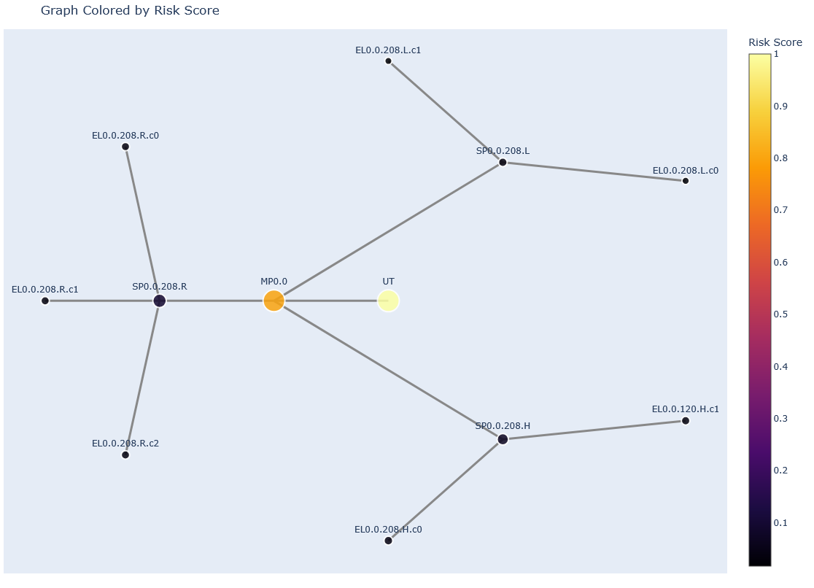
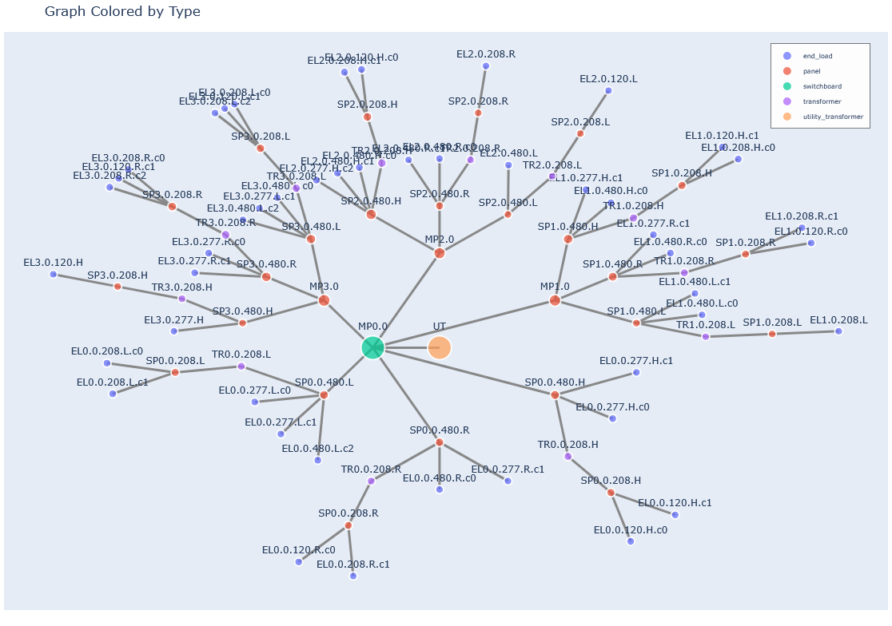
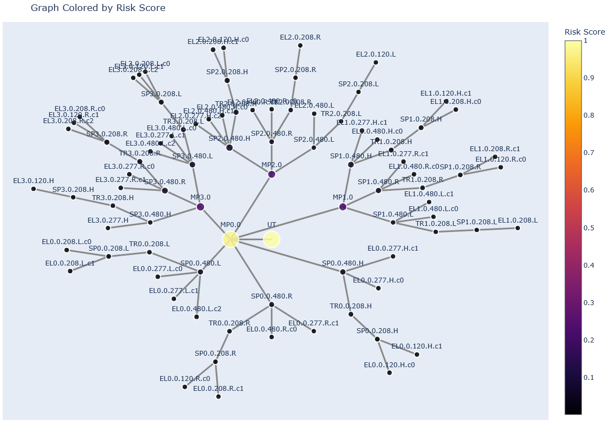

# Abstract
Building systems face hidden risks and cascading failures due to interdependencies, exposing limitations in current asset management tools. To address gaps in simulating interdependent lifecycles and evaluating maintenance under constraints, using synthetic data, we developed AssetPulse. AssetPulse is a graph-based framework and platform that integrates risk assessment and budget-constrained scheduling that enables scenario analysis and quantitative evaluation of lifecycle trade-offs, revealing insights into maintenance planning and asset optimization.

# Introduction
## Problem
Building services systems, and other physical asset portfolios, must maintain performance, safety, and continuity over long lifecycles. Yet maintenance remains reactive; driven by budgets, tradition, or vendor advice rather than lifecycle intelligence. Competing priorities and uncertain returns on preventative investment lead to deferred maintenance and rising risk. Interdependencies between building systems compound failure risks, but asset managers lack tools to model these dynamics or simulate long-term outcomes under real-world budget constraints. While digital twins, sensor-based monitoring, and predictive maintenance technologies are advancing, they tend to focus on either static asset databases, real-time telemetry from building management systems, or enterprise-level CMMS platforms oriented toward task scheduling. This research addresses the gap with AssetPulse, a simulation framework for evaluating system dependencies, component degradation, and maintenance trade-offs in low-voltage electrical systems under data-limited, budget-constrained conditions.

# Framework

The AssetPulse framework comprises a synthetic data generator and a remaining useful life simulation engine. The generator creates detailed graphs of building electrical systems, including nodes for utility transformers, panels, switchboards, transformers, and end loads, along with their attributes and connections. The simulation engine uses these graphs to model maintenance activities, calculate remaining useful life for each component, and assess risk based on user-defined parameters and maintenance templates.

The diagram shows the architecture and workflow of AssetPulse, including the user interface, graph controller, simulation engine, and data storage.


# Background and State of the Art
Digital asset management solutions span enterprise maintenance platforms, building management systems, and predictive maintenance tools. Enterprise systems such as IBM Maximo, SAP Intelligent Asset Management, and contemporary CMMS platforms (e.g., Fiix, Uptake) provide asset inventories, work-order execution, preventative maintenance scheduling, risk registers, and basic condition-based prioritization. These platforms are highly effective at operational coordination and compliance tracking, yet they primarily function as transactional databases and workflow engines. They neither explicitly encode component-to-component dependencies nor support forward-looking simulation of degradation and maintenance policies over multi-year horizons.

Building management systems (BMS) and IoT-enabled monitoring platforms increasingly incorporate fault detection and predictive diagnostics, but they focus on real-time system performance and equipment-level anomaly detection rather than long-term strategic planning. Meanwhile, infrastructure-oriented asset platforms such as Bentley AssetWise introduce network modeling capabilities, though their emphasis is on civil and utility networks where data density and asset hierarchies differ significantly from building-scale electrical systems.

Across these categories, current tools are optimized for operations, monitoring, and task execution, not lifecycle simulation, system-dependency modeling, or budget-constrained scenario analysis.

Parallel academic research has explored graph-based modeling for electrical networks, including circuit-level visualization and topology analysis [@http://zotero.org/users/local/mkjTYlJ0/items/467T4EC7], graph neural networks for fault prediction and power-system event modeling [@http://zotero.org/users/local/mkjTYlJ0/items/72GLGXMP]; [@http://zotero.org/users/local/mkjTYlJ0/items/FI5MZ9ET], and algorithmic generation of one-line diagrams using evolutionary techniques [@http://zotero.org/users/local/mkjTYlJ0/items/ISYSAWMH]. Knowledge-graph approaches have also been applied to power-communication networks [@http://zotero.org/users/local/mkjTYlJ0/items/KH3PUY3X] and to the built environment more broadly [@http://zotero.org/users/local/mkjTYlJ0/items/F94C3U62], emphasizing semantic representation and asset relationships. These works demonstrate the value of graph structures for understanding electrical systems and organizing building asset information, yet they predominantly focus on high-voltage or micro-circuit domains and prioritize ontology development, visualization, or prediction rather than lifecycle simulation or maintenance decision support.

Across both industry practice and research, a gap exists in methods capable of representing building systems as interdependent networks, simulating degradation and failure propagation, and evaluating maintenance and budget strategies over time—especially in scenarios where real performance and maintenance datasets are limited. This work contributes to addressing this gap by developing a graph-based simulation approach that incorporates synthetic data generation, asset degradation modeling, and budget-constrained maintenance logic to explore lifecycle trade-offs, risk accumulation, and investment prioritization in building electrical systems.

# Methodology

## User Defined Parameters

*Table: User-defined parameters and template fields in AssetPulse*

<table>
  <tr>
    <th colspan="3">Parameters</th>
    <th colspan="2">Template Fields</th>
  </tr>
  <tr>
    <th>Building Electrical System Generation</th>
    <th>Remaining Useful Life (RUL) Simulation</th>
    <th>Budget</th>
    <th>Maintenance Task</th>
    <th>Repair and Replacement Task</th>
  </tr>

  <tr><td>Construction Year</td><td>TASK_DEFERMENT_FACTOR</td><td>Monthly Budget (Hours)</td><td>task_id</td><td>task_id</td></tr>
  <tr><td>Total Load</td><td>OVERDUE_IMPACT_MULTIPLIER</td><td>Monthly Budget (Dollars)</td><td>equipment_type</td><td>equipment_type</td></tr>
  <tr><td>Building Length</td><td>AGING_ACCELERATION_FACTOR</td><td>Enable Budget Rollover</td><td>task_type</td><td>task_name</td></tr>
  <tr><td>Building Width</td><td>MAX_AGING_MULTIPLIER</td><td>Weeks to Schedule Ahead</td><td>recommended_frequency_months</td><td>description</td></tr>
  <tr><td>Number of Floors</td><td>DEFAULT_LIFESPANS</td><td></td><td>description</td><td>time_cost</td></tr>
  <tr><td>Floor Height</td><td>BASE_FAILURE_RATES</td><td></td><td>default_priority</td><td>money_cost</td></tr>
  <tr><td>Cluster Strength</td><td>DEFAULT_INITIAL_CONDITION</td><td></td><td>time_cost</td><td>condition_level</td></tr>
  <tr><td>Random Seed</td><td>MIN_RUL_RATIO</td><td></td><td>money_cost</td><td>condition_improvement_amount</td></tr>

  <tr><td></td><td>CRITICAL_RUL_THRESHOLD_YEARS</td><td></td><td>notes</td><td>base_expected_lifespan_improvement_percentage</td></tr>
  <tr><td></td><td>HIGH_RUL_THRESHOLD_YEARS</td><td></td><td></td><td>notes</td></tr>
  <tr><td></td><td>MEDIUM_RUL_THRESHOLD_YEARS</td><td></td><td></td><td></td></tr>
  <tr><td></td><td>REPLACEMENT_THRESHOLD_YEARS</td><td></td><td></td><td></td></tr>
  <tr><td></td><td>ENABLE_RUL_WARNINGS</td><td></td><td></td><td></td></tr>
  <tr><td></td><td>ENABLE_DEBUG_OUTPUT</td><td></td><td></td><td></td></tr>
  <tr><td></td><td>TYPES_TO_IGNORE</td><td></td><td></td><td></td></tr>
</table>

Users can customize building generation and RUL simulation with parameters for building characteristics, RUL factors, maintenance and repair/replacement task templates, and budget constraints. See Appendices A and B for details.

#### Default Lifespans and Base Failure Rates

The table below shows default expected lifespans and base annual failure rates for common equipment types. These values are used if no custom lifespans or failure rates are provided.

<table>
<caption><strong>Default Lifespans and Base Failure Rates</strong></caption>
<thead>
<tr>
	<th>Equipment Type</th>
	<th>Default Lifespan (years)</th>
	<th>Base Failure Rate (annual)</th>
</tr>
</thead>
<tbody>
	<tr><td>Utility Transformer</td><td>35</td><td>1.5%</td></tr>
	<tr><td>Transformer</td><td>30</td><td>2.0%</td></tr>
	<tr><td>Switchboard</td><td>25</td><td>2.5%</td></tr>
	<tr><td>Panelboard</td><td>20</td><td>3.0%</td></tr>
	<tr><td>End Load</td><td>15</td><td>5.0%</td></tr>
</tbody>
</table>

### Maintenance Task Templates

Maintenance tasks are defined via templates specifying task type, equipment type, frequency, time and money cost, and priority. These standardize maintenance and guide the simulation engine in generating and scheduling tasks for each equipment node. Tasks are prioritized by risk and template priority, with critical repairs and replacements taking precedence. Each task is linked to a specific equipment node and scheduled accordingly. For example, a template may define an annual grounding test for panels, costing 2 hours and $150, which the engine schedules for each panel based on installation date. Each month’s task list includes scheduled, executed, and deferred tasks, with deferrals due to budget or other constraints.

### Repair and Replacement Task Templates
Repair and replacement tasks are defined via templates specifying task type, equipment type, time and money cost, and condition thresholds. The simulation engine uses these to generate and schedule tasks for equipment flagged due to low RUL or poor condition, prioritizing them over routine maintenance. Tasks are scheduled based on risk and budget, with deferrals occurring if funds are insufficient. 

When multiple repairs are flagged, the engine prioritizes them by risk and budget, potentially consuming the entire budget and deferring routine maintenance—reflecting real-world trade-offs where critical repairs take precedence over preventive actions. This can lead to consecutive months where all budget is spent on repairs, deferring routine maintenance.

### Budget Parameters
The simulation engine lets users define monthly time and money budgets, which determine task execution order, with higher-priority tasks scheduled first. Users can enable budget rollover, allowing unused funds to carry over. These parameters are key to generating meaningful simulation results, enabling operators to explore how varying budget scenarios impact asset management outcomes.

## Building Electrical System Generation Logic
The generator uses user-specified building parameters to compute derived attributes such as total area and total load. It calculates one vertical riser per 500 square meters of floor area, rounding up, and places them along the longer dimension and centered on the shorter, with slight randomness. System voltage is determined by total load, with step-down transformers used where needed, employing standard three-phase levels (e.g., 480Y/277V, 208Y/120V). Total load is distributed across floors with ±10% variation, and end loads (lighting, HVAC, receptacles) are assigned to floors and connected to the nearest riser, each receiving a type, power rating, and voltage. For each riser and floor, the generator summarizes power per load type and voltage to size distribution equipment. Distribution equipment—including main and sub-panels, transformers—is placed as needed, and the graph connects utility transformers to main panels, main panels to risers, risers to distribution equipment, and equipment to end loads. Helper modules assign risk scores and remaining useful life to each node, a summary report is generated (total load, equipment counts, load breakdown, floor and riser details), and the graph is saved in GraphML for analysis.

[See Appendix C for examples of generated Electrical Building Graphs.](#c-building-electrical-system-generation)

We use the following formula to calculate the risk score for each piece of equipment:

```
propagated_power = graph.nodes[node].get('propagated_power', 0) or 0
norm_power = propagated_power / total_load if total_load else 0
descendants_count = filtered_descendants_count(graph, node)
norm_descendants = descendants_count / max_descendants
risk = (norm_power + norm_descendants) / 2
```

The filtered_descendants_count function counts the number of downstream equipment nodes, excluding end loads, to focus on critical distribution components. The risk score is then normalized between 0 and 1, with higher values indicating greater risk.

## Remaining Useful Life (RUL) Simulation Logic

Before calculating remaining useful life, the simulation engine assesses equipment risk based on load and downstream dependencies. Risk is determined by normalizing the node's propagated power and the number of downstream equipment nodes (excluding end loads), then averaging the two. Higher load and more downstream connections increase risk, reflecting greater system impact if the equipment fails. The risk score is normalized between 0 and 1, with higher values indicating higher risk.

### Remaining Useful Life (RUL) Simulation
The RUL simulation engine calculates remaining useful life for each equipment node monthly, based on user-defined parameters including lifespans, failure rates, aging factors, and maintenance impact. It begins by generating maintenance tasks from the building graph and task templates, then initializes RUL parameters. Each month, the engine updates the date and recalculates RUL for all nodes by determining installation date, expected lifespan, and operating history. Baseline RUL is adjusted for deferred maintenance using deferment and overdue impact factors, while aging acceleration and maximum multiplier limit degradation. RUL is further adjusted based on current condition, with a minimum condition factor applied, and capped below a threshold of expected lifespan.

Failure probability is computed using base failure rates, aging, and condition, and risk levels (LOW, MEDIUM, HIGH, CRITICAL) are assigned based on RUL and condition thresholds. Equipment meeting replacement thresholds is flagged for replacement. RUL (in days and years), risk level, failure probability, and condition history are stored per node, with optional warnings for critical conditions.

Monthly maintenance scheduling prioritizes tasks by frequency, installation date, and risk. Tasks are scheduled within time and money budgets, with over-budget tasks deferred and unused funds rolling over if enabled. Synthetic maintenance logs simulate condition changes using a beta distribution (alpha=5, beta=1), producing realistic condition ratings (0.0–1.0) with a random seed for reproducibility. Replacement tasks, prioritized over routine tasks, improve condition and update maintenance history; deferred tasks increase the deferred count, affecting future RUL.

The simulation generates detailed reports each month, recording scheduled, executed, and deferred tasks, maintenance logs, and replacement actions. The updated graph state, including RUL, condition, and risk, is saved monthly for time-series analysis. System-wide summaries track total tasks, budget utilization, and risk distribution, while component-level metrics and maintenance histories support further analysis and visualization.

The beta distribution function is shown below, with alpha=5 and beta=1, which skews the distribution towards higher condition values, simulating realistic maintenance outcomes:


# Results

## Simulation Output
The simulation outputs monthly RUL and risk results in a dictionary format, with keys for each month (e.g., "2023-01"). Each record includes scheduled tasks—covering all planned activities, including deferred tasks—budget details (allocation and rollover), and the full building graph in NetworkX format. The graph reflects all monthly changes, such as executed maintenance, condition updates, and replacements, enabling time-series analysis and visualization.

| Output Component | Description |
|---|---|
| Month identifier | Month key in format "YYYY-MM" (e.g., "2023-01") |
| tasks_scheduled | Complete list of all tasks planned for the month, including deferred tasks from previous months |
| rollover_time_budget | Unused time budget carried forward from the previous month (if rollover enabled) |
| rollover_money_budget | Unused money budget carried forward from the previous month (if rollover enabled) |
| time_budget | Monthly time budget allocation added to rollover amount for total available hours |
| money_budget | Monthly money budget allocation added to rollover amount for total available funds |
| graph | Updated NetworkX building graph with current RUL, risk levels, conditions, and structural information |
| executed_tasks | Tasks successfully completed during the month with details on type, equipment, costs, and status |
| deferred_tasks | Tasks postponed during the month including deferral reasons and scheduling impacts |
| maintenance_logs | Synthetic maintenance activity records for inspections, repairs, and replacements (if enabled) |
| replacement_tasks_executed | Completed equipment replacement tasks with component and cost details |
| replacement_tasks_not_executed | Planned replacement tasks that were not completed with reasons for non-execution |

Using this simulation engine we are able to display relavent analytics on Remaining Useful Life of Equipment, overall system risks, and calculate maintenance costs; in both the present state, projected future states and historical trends.


## Optimization

Using the simulation engine, we optimized maintenance scheduling and budget allocation by developing a multi-variable optimization model to minimize deferred maintenance over one year. 


In most cases, higher budgets reduced deferred tasks, but in some scenarios, lower budgets led to fewer deferrals due to equipment failures triggering necessary repairs that improved system condition and reduced future maintenance needs. We tested multiple building configurations with varying monthly time and money budgets, but results depend on accurate simulation parameters and task templates. Future work will calibrate the model with real-world data to improve predictive accuracy.


# Discussion

## User Input

In reality, maintenance and replacement tasks depend on equipment and manufacturer guidelines. For this simulation, we use generic tasks for broad equipment categories, but users can customize templates to reflect their practices. Greater accuracy may require more granular equipment types—such as "transformer_small" and "transformer_large"—to ensure appropriate tasks are applied. This enables precise maintenance strategies based on equipment characteristics. Future research should explore detailed classifications and their impact on asset management using real-world data.

## Building Generation

The synthetic data generator produces complete building electrical system graphs with all required node types, connections, and attributes, enabling testing and validation of AssetPulse’s RUL simulation and maintenance scheduling. The generator distributes loads, sizes and places distribution equipment based on load and layout, and connects nodes in a logical hierarchy from utility transformer to end load. This allows determination of electrical load at each node, used to calculate risk scores, which in turn prioritize maintenance tasks and influence failure probabilities during RUL simulation. Under budget constraints, higher-risk equipment—such as main panels and switchboards—is prioritized, while lower-risk equipment may be deferred. If lower-risk equipment fails due to deferred maintenance, the impact on overall system performance is limited, as higher-risk equipment is maintained and less likely to fail.

### Other System Graphs
The synthetic data generator can be adapted to create system graphs for other domains—such as water distribution, HVAC, or transportation—by modifying node types, connections, and attributes. This flexibility allows AssetPulse to support diverse asset management applications. The core RUL simulation logic remains unchanged, but users must define domain-specific equipment types, lifespans, failure rates, and maintenance tasks. For example, in a water network, equipment like pumps, valves, and pipes would require tailored maintenance and failure models. To compute risk scores, graphs must include load information or a domain-specific risk assessment method. Required node attributes for RUL simulation include: `type` `installation_date` `expected_lifespan` `replacement_cost` `current_condition`

# Conclusion

The synthetic data generator and RUL simulation provide a framework for testing and validating asset management strategies in complex systems. By modeling equipment relationships and attributes, AssetPulse enables optimized maintenance scheduling, cost reduction, and improved system reliability. Future work will refine simulation parameters, calibrate with real-world data, expand to additional infrastructure systems, and enhance data export for integration with BIM and asset management software.

# References

::: {#refs}
:::

# Appendix

## A. Parameters

### A.1. Building Electrical System Generation Parameters
| Parameter | Description | Units / Range |
|---|---|---|
| Construction Year | Older buildings allow simulation of more failures and maintenance needs. | Year |
| Total Load | Total electrical load of the building; influences number and type of distribution equipment. | VA |
| Building Length | Length of the building footprint; affects spatial distribution of equipment and number of vertical risers. | m |
| Building Width | Width of the building footprint; affects spatial distribution of equipment and number of vertical risers. | m |
| Number of Floors | Total number of floors; determines vertical distribution and riser lengths. | Integer |
| Floor Height | Height of each floor; influences vertical spacing and riser lengths. | m |
| Cluster Strength | Determines how end loads are grouped in the generated graph (0 = maximally clustered, 1 = all individual). Does not affect distribution equipment generation. | 0–1 |
| Random Seed | Optional integer seed for random number generation to ensure reproducibility of the synthetic data. | Integer (optional) |

### A.2. Remaining Useful Life (RUL) Simulation Parameters
| Parameter | Description | Type / Notes |
|---|---|---|
| `TASK_DEFERMENT_FACTOR` | Impact of each deferred maintenance task on remaining useful life (RUL) reduction. Higher values increase the penalty for deferred tasks. | Unitless multiplier |
| `OVERDUE_IMPACT_MULTIPLIER` | Multiplier for how much overdue maintenance affects RUL. Higher values make overdue tasks more detrimental. | Unitless multiplier |
| `AGING_ACCELERATION_FACTOR` | Rate at which aging increases failure probability. Higher values mean equipment ages faster. | Unitless rate |
| `MAX_AGING_MULTIPLIER` | Maximum cap on aging impact to prevent runaway aging effects. | Unitless cap |
| `DEFAULT_LIFESPANS` | Default expected lifespans (years) for different equipment types. | See "Default Lifespans" table |
| `BASE_FAILURE_RATES` | Base annual failure probabilities for different equipment types. | See "Default Base Failure Rates" table |
| `DEFAULT_INITIAL_CONDITION` | Initial condition rating for new equipment (1.0 = perfect). | Float (0–1) |
| `MIN_RUL_RATIO` | Minimum ratio of expected lifespan that RUL can be reduced to (prevents unrealistic low values). | Float (0–1) |
| `CRITICAL_RUL_THRESHOLD_YEARS` | RUL threshold (years) below which equipment is considered CRITICAL risk. | Years |
| `HIGH_RUL_THRESHOLD_YEARS` | RUL threshold (years) below which equipment is considered HIGH risk. | Years |
| `MEDIUM_RUL_THRESHOLD_YEARS` | RUL threshold (years) below which equipment is considered MEDIUM risk. | Years |
| `REPLACEMENT_THRESHOLD_YEARS` | Risk level (RUL in years) at which equipment is flagged for replacement. Set to `None` to disable automatic replacement flagging. | Years or `None` |
| `ENABLE_RUL_WARNINGS` | Enable or disable warnings for critically low RUL during calculations. | Boolean |
| `ENABLE_DEBUG_OUTPUT` | Enable or disable detailed debug output during RUL calculations. | Boolean |
| `TYPES_TO_IGNORE` | Equipment types to exclude from RUL calculations. | List of type names |

### A.3. Budget Parameters

| Parameter | Description | Units / Range |
|---|---|---|
| Monthly Budget (Hours) | Set the monthly hour budget for maintenance tasks. This limits how many maintenance activities can be performed each month. | Hours |
| Monthly Budget (Dollars) | Set the monthly dollar budget for maintenance tasks. This limits the total cost of maintenance activities each month. | Dollars |
| Enable Budget Rollover | Allow unused budget from one month to carry over to the next, providing flexibility in scheduling. | Boolean |
| Weeks to Schedule Ahead | Set how many weeks past the current date the maintenance scheduler should plan tasks. | Weeks |


## B. Template Fields
### B.1. Maintenance Task Template Fields

| Task Template Field            | Description                                         |
|-------------------------------|-----------------------------------------------------|
| task_id                       | The unique identifier for the maintenance task. When the tasks for each piece of equipment are generated from the template, this field is concatenated with the equipment ID to ensure uniqueness. |
| equipment_type                | The type of equipment this maintenance task applies to (e.g., "panel", "transformer"). |
| task_type                     | The category of maintenance task (e.g., "inspection", "cleaning", "testing"). Repair and replacement tasks are handled separately using the Repair and Replacement Task Templates. |
| recommended_frequency_months  | The recommended interval (in months) between recurring maintenance tasks. Tasks will be scheduled based on this frequency starting from the equipment installation date. When a task is deferred, the next occurrence will be scheduled based on the deferral date. |
| description                   | A brief explanation of the maintenance task's purpose and activities. This field is optional and can be left blank. |
| default_priority              | The default priority level assigned to the task for scheduling and resource allocation. Lower numbers indicate higher priority. Tasks with the same priority are scheduled based on the node's risk score. |
| time_cost                     | Estimated time required to complete the task (in hours). |
| money_cost                     | Estimated monetary cost to perform the task (in dollars). |
| notes                         | Additional information or special instructions related to the task. This field is optional and can be left blank. |

### B.2. Repair and Replacement Task Template Fields

| Repair/Replacement Task Template Field | Description                                         |
|---------------------------------------|-----------------------------------------------------|
| task_id                              | The unique identifier for the repair or replacement task. When the tasks for each piece of equipment are generated from the template, this field is concatenated with the equipment ID to ensure uniqueness. |
| equipment_type                       | The type of equipment this repair or replacement task applies to (e.g., "panel", "transformer"). |
| task_name                            | The name of the repair or replacement task (e.g., "replace breaker", "repair transformer"). |
| description                          | A brief explanation of the task's purpose and activities. This field is optional and can be left blank. |
| time_cost                            | Estimated time required to complete the task (in hours). |
| money_cost                           | Estimated monetary cost to perform the task (in dollars). |
| condition_level                      | The condition threshold (0.0 to 1.0) below which the equipment is flagged for this task. For example, a value of 0.3 means the task is triggered when the equipment condition falls below 30%. |
| condition_improvement_amount         | The amount by which the equipment's condition improves after completing the task (e.g., 0.05 means a piece of equipment that is at 0.85 will improve to 0.90). |
| base_expected_lifespan_improvement_percentage | The percentage increase in expected lifespan after completing the task (e.g., 0.10 means a piece of equipment with a baseline expected lifespan of 20 years will increase to 22 years). |
| notes                                | Additional information or special instructions related to the task. This field is optional and can be left blank. |


## C: Building Electrical System Generation

### C.1 Example Test Data: Simple Building
The following parameters were used to generate a simple building for testing and validation of the AssetPulse simulation tool:

- Construction Year: 2000
- Total Load: 200 kW
- Building Length: 20 m
- Building Width: 20 m
- Number of Floors: 1
- Floor Height: 3.5 m
- Cluster Strength: 0.95
- Random Seed: 42

### C.2 Example Generated Building Graph

#### Types of Nodes


#### Risk Levels



### C.3: Example Test Data: Complex Building
The following parameters were used to generate a complex building for testing and validation of the AssetPulse simulation tool:

- Construction Year: 2000
- Total Load: 1000 kW
- Building Length: 20 m
- Building Width: 20 m
- Number of Floors: 4
- Floor Height: 3.5 m
- Cluster Strength: 0.95
- Random Seed: 42

### C.4 Example Generated Building Graph
#### Types of Nodes



#### Risk Levels



